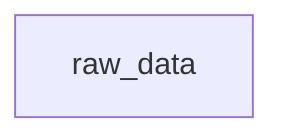

# Pipeline Tutorial

> A step-by-step guide to T's pipeline execution model

Pipelines are T's core execution model. They let you define named computation steps (nodes) that are automatically ordered by their dependencies, executed deterministically, and cached for re-use.

---

## 1. Your First Pipeline

A pipeline is a block of named expressions enclosed in `pipeline { ... }`:

```t
p = pipeline {
  x = 10
  y = 20
  total = x + y
}
```

This creates a pipeline with three nodes: `x`, `y`, and `total`. Each node is computed once, and the results are cached. Access any node's value with dot notation:

```t
p.x      -- 10
p.y      -- 20
p.total  -- 30
```

The pipeline itself displays as:

```
Pipeline(3 nodes: [x, y, total])
```

### 1.1 The Interactive Development Loop (Build, Inspect, Plot, and Extend)

A common and highly productive way to build T-Lang pipelines is incrementally, using an interactive REPL development loop. By starting small and iteratively building, inspecting, plotting, and extending, you ensure that each step of your data pipeline behaves as expected.

#### Step 1: Start with a Single Node

First, define a pipeline with a single root node. For example, loading some raw data:

```t
p = pipeline {
  raw_data = [1, 2, 3, 4, 5]
}
```

#### Step 2: Build the Pipeline

Build the pipeline to materialize the raw data node as a Nix artifact:

```t
build_pipeline(p)
```

During this build, Nix runs the computation (in this case, just returning the vector `[1, 2, 3, 4, 5]`) and caches it in the Nix store.

#### Step 3: Check, Inspect, and Verify

Once built, verify that the node was evaluated correctly:

- **Check value in-memory**: Access the node directly using dot notation:
  ```t
  p.raw_data
  -- [1, 2, 3, 4, 5]
  ```
- **Verify the serialized artifact**: Use `read_node()` to ensure the serialized value can be successfully read from the Nix store cache:
  ```t
  read_node(p.raw_data)
  -- [1, 2, 3, 4, 5]
  ```
- **Inspect build logs**: Check the latest build log to see the build execution time and status:
  ```t
  inspect_log()
  -- A DataFrame showing the derivation path and build status of "raw_data"
  ```
- **Explain diagnostics**: Call `explain()` to view properties and runtime environment information:
  ```t
  explain(p.raw_data)
  -- { `runtime`: "T", `kind`: "node", `name`: "raw_data", ... }
  ```

#### Step 4: Plot the DAG

Visualize the current topology of your pipeline. You can render the DAG directly in your web browser by calling `show_plot()` on the pipeline:

```t
show_plot(p)
```

Alternatively, you can convert the dependency graph to a Mermaid string to print or render in Markdown:

```t
print(pipeline_to_mermaid(p))
```

Output:


#### Step 5: Add Another Node

First, save your current pipeline state into `p_old` so you can diff it later:

```t
p_old = p
```

Now, extend your pipeline by adding a second node that depends on the first one. For example, calculating the sum of the raw data:

```t
p = pipeline {
  raw_data = [1, 2, 3, 4, 5]
  total = sum(raw_data)
}
```

#### Step 6: Build, Verify, and Plot Again

Re-build your extended pipeline:

```t
build_pipeline(p)
```

Because `raw_data` was already built and cached, Nix will automatically skip rebuilding it (a cache hit) and only compute the new `total` node! You can verify this cache hit behavior by running a cache-aware dry run first:

```t
plan = build_pipeline(p, dry_run = true)
print(plan)
-- DataFrame(2 rows x 3 cols: [node, action, store_path])
-- node       action       store_path
-- raw_data   cache_hit    /nix/store/...-raw_data
-- total      rebuild      /nix/store/...-total
```

After building, inspect the new node and dependency layout:

- **Verify the new node**:
  ```t
  p.total
  -- 15

  read_node(p.total)
  -- 15
  ```
- **Inspect the new DAG**: Plot the updated dependency graph to verify the relationship. You can open it in the browser:
  ```t
  show_plot(p)
  ```
  Or get the Mermaid source:
  ```t
  print(pipeline_to_mermaid(p))
  ```
  Output:
  ```mermaid
  graph TD
    raw_data --> total
  ```
- **Compare pipeline changes**: If you want to check what changed structurally since your last pipeline definition, you can use `pipeline_diff()`:
  ```t
  diff = pipeline_diff(p_old, p)
  print(diff.added_nodes)
  -- ["total"]
  ```

By following this loop—**Build ➔ Verify ➔ Plot ➔ Extend**—you can comfortably build up large, complex, and reliable data pipelines step by step.

---

## 2. Pipeline Function Quick Reference

A consolidated index of all pipeline reading, inspecting, and build-log functions. Use this as a cheatsheet to find the right tool for the job.

### Reading Node Artifacts

| Function | Parameters | Returns | What it does |
|---|---|---|---|
| `read_node(node)` | `ComputedNode` | deserialized value + diagnostics | Read in-scope pipeline node artifact |
| `read_past_node(p.name, which_log)` | NSE-captured node, `String` (required) | deserialized value + diagnostics | Read from historical build log without pipeline in scope |
| `read_pipeline(p)` | `Pipeline` | `Dict` | Per-node values + diagnostics + aggregated summary |
| `pipeline_node(p, name)` | `Pipeline`, `String` | `Any` | Value of a specific node by name |

### Build Logs & History

| Function | Parameters | Returns | What it does |
|---|---|---|---|
| `build_log(p, which_log?)` | `Pipeline`, optional `String` | `BuildLog` | Structured build log for latest (or specified) build |
| `build_log_to_frame(log)` | `BuildLog` | `DataFrame` | Build log as DataFrame (name, status, duration, path) |
| `build_log_history(p, n?, pattern?)` | `Pipeline`, optional `Int`, `String` | `DataFrame` | History of all builds matching pipeline's node signature |
| `list_logs()` | — | `DataFrame` | All log files in `_pipeline/` (filename, mtime, size, pipeline) |
| `inspect_log(p?, which_log?)` | optional `Pipeline`, optional `String` | `DataFrame` | Derivation-level build status (derivation, build_success, path) |
| `read_log(node_name)` | `String` | `String` | Raw Nix build log text for a specific node |

### Node Inspection & Diagnostics

| Function | Parameters | Returns | What it does |
|---|---|---|---|
| `inspect_node(node)` | `ComputedNode` | `Dict` | Static metadata (runtime, path, class, deps) + structured warnings |
| `warning_msg(node)` | `ComputedNode` | `String` | Formatted warning message (own + upstream with source prefix) |
| `collect_exceptions(p)` | `Pipeline` | `DataFrame` | Structured error/warning DataFrame from built pipeline |
| `suppress_warnings(val)` | `Any` | original value | Suppress console warnings for a node; still accessible via `warning_msg()` |
| `debug_node(node)` | `ComputedNode` | `NA` | Interactive REPL subshell pre-configured with node environment |
| `rebuild_node(node)` | `ComputedNode` | `ComputedNode` | Rebuild a single node and return updated artifact path |

### Pipeline DAG Structure

| Function | Parameters | Returns | What it does |
|---|---|---|---|
| `pipeline_to_frame(p)` | `Pipeline` | `DataFrame` | Full node metadata (runtime, serializer, deps, depth, command_type) |
| `pipeline_nodes(p)` | `Pipeline` | `List[String]` | All node names |
| `pipeline_deps(p)` | `Pipeline` | `Dict` | Node name → list of dependency names |
| `pipeline_edges(p)` | `Pipeline` | `List[[from, to]]` | Edge list as dependency pairs |
| `pipeline_roots(p)` | `Pipeline` | `List[String]` | Nodes with no dependencies |
| `pipeline_leaves(p)` | `Pipeline` | `List[String]` | Nodes that nothing depends on |
| `pipeline_depth(p)` | `Pipeline` | `Int` | Maximum topological depth |
| `pipeline_cycles(p)` | `Pipeline` | `List[String]` | Nodes involved in cycles (empty = valid) |
| `pipeline_validate(p)` | `Pipeline` | `List[String]` | Validation errors (empty = valid); checks missing deps + cycles |
| `pipeline_assert(p)` | `Pipeline` | `Pipeline` | Throws first error, or returns pipeline unchanged |
| `pipeline_print(p)` | `Pipeline` | `NA` | Pretty-print node table to stdout |
| `pipeline_to_dot(p)` | `Pipeline` \| `MetaPipeline` | `String` | Graphviz DOT representation |
| `pipeline_to_mermaid(p)` | `Pipeline` \| `MetaPipeline` | `String` | Mermaid flowchart diagram |
| `trace_nodes(p, name?)` | `Pipeline`, optional `String` | `NA` | Visual dependency tree printer |
| `pipeline_cache_status(p)` | `Pipeline` | `DataFrame` | Nix store cache hits per node (cached, store_path) |
| `pipeline_to_drv(p)` | `Pipeline` | `Dict` | Node → derivation (.drv) path mapping |
| `pipeline_to_store(p)` | `Pipeline` | `Dict` | Node → Nix store output path mapping |

### Node-Level Filtering & Diffs

| Function | Parameters | Returns | What it does |
|---|---|---|---|
| `select_node(p, ...)` | `Pipeline`, `Symbol`... | `DataFrame` | Column projection from `pipeline_to_frame` |
| `which_nodes(p, predicate)` | `Pipeline`, `Function` (NSE) | `List` | Node records from `read_pipeline(p).nodes` matching predicate |
| `errored_nodes(p)` | `Pipeline` | `List` | Convenience wrapper: nodes with non-NA `diagnostics.error` |
| `node_diff(a, b, log_a?, log_b?)` | `ComputedNode` ×2, optional `String`/`Int` | `VDict` | Compare node artifacts across builds |
| `pipeline_diff(a, b)` | `Pipeline` ×2 | `Dict` | Structural diff between two pipeline DAGs |

### Export / Import / GC

| Function | Parameters | Returns | What it does |
|---|---|---|---|
| `pipeline_copy(node?, target_dir?)` | optional `String`, `String` | `String` | Copy artifacts from Nix store to local directory |
| `export_artifacts(p, archive)` | `Pipeline`, `String` | `String` | Export cached artifacts to portable archive |
| `import_artifacts(target_or_archive, archive?)` | `Pipeline` or `String`, optional `String` | `String` | Import previously exported archive |
| `inspect_artifacts(archive)` | `String` | `DataFrame` | Preview archive contents without importing |
| `pipeline_gc(p, dry_run?)` | `Pipeline`, optional `Bool` | `DataFrame` | GC pipeline store paths (dry_run=true previews) |
| `t_gc()` | — | `String` | Global Nix garbage collection |

---

## 3. Explicit Node Configuration

In addition to bare assignments, you can explicitly configure nodes using the `node()` function. This lets you define the execution environment (like the `runtime`) and custom serialization methods for when a pipeline is materialized by Nix:

```t
p = pipeline {
  data = node(command = read_csv("data.csv"), runtime = T)
  
  -- Running a Python node that trains a model using the pyn wrapper
  model = pyn(
    command = <{
        from sklearn.linear_model import LinearRegression
        fit = LinearRegression().fit(X, y)
        fit
    }>,
    serializer = "pmml"
  )
}
```

Bare syntax (like `x = 10`) is automatically desugared to `x = node(command = 10, runtime = T, serializer = default, deserializer = default)`. You can also use `pyn()`, `rn()`, and `shn()` as shortcuts for Python, R, and shell runtimes. T enforces cross-runtime safety: if a node with a non-`T` runtime depends on a `T` node, or vice versa, you should specify an explicit `serializer`/`deserializer`.

When an R node returns a `ggplot2` object, a Python node returns a `matplotlib` / `plotnine` plot object, or a Julia node returns a `TidierPlots.jl`, `Plots.jl`, or `Makie.jl` figure object, T preserves lightweight plot metadata for REPL inspection. Reading or printing those artifacts shows a structured summary with the plot class (`ggplot`, `matplotlib`, `plotnine`, `tidierplots`, `plotsjl`, or `makie`), runtime backend (`R`, `Python`, or `Julia`), title, labels, mappings when available, and layer information instead of a raw runtime-specific object dump.

### Using the `script` Argument

Instead of inlining code with `command`, you can point a node to an external source file using the `script` argument. This works with `node()`, `pyn()`, `rn()`, and `shn()`. The `script` and `command` arguments are mutually exclusive.

```t
p = pipeline {
  -- Execute an external R script
  model = rn(script = "train_model.R", serializer = "pmml")

  -- Execute an external Python script
  predictions = pyn(script = "predict.py", deserializer = "pmml")

  -- Execute an external shell script
  report = shn(script = "postprocess.sh")

  -- node() auto-detects the runtime from the file extension
  summary = node(script = "summarise.R", serializer = "json")
}
```

When using `script`, the runtime is auto-detected from the file extension (`.R` → R, `.py` → Python, `.sh` → sh) if not explicitly set via the `runtime` argument. T reads the script file to extract identifier references, allowing the pipeline dependency graph to be built correctly from variables referenced in the external file.

### Shell / Bash nodes with `shn()`

Use `shn()` for pipeline steps that are easiest to express as shell or CLI commands. It is a convenience wrapper around `node(runtime = sh, ...)`, just like `rn()` and `pyn()` wrap `node()` for R and Python.

```t
p = pipeline {
  -- Exec-style shell node: command + positional argv
  fields = shn(
    command = "printf",
    args = ["first line\\nsecond line\\n"]
  )

  -- Script-style shell node: inline shell source executed with `sh`
  report = shn(command = <{
#!/bin/sh
set -eu

# Dependencies for T's lexical pipeline analysis: summary_r summary_py
printf 'R summary: %s\n' "$T_NODE_summary_r/artifact"
printf 'Python summary: %s\n' "$T_NODE_summary_py/artifact"
  }>)
}
```

There are two useful modes:

- **Exec mode**: provide a string `command` plus `args = [...]` to run a program directly with positional arguments.
- **Shell mode**: provide raw shell source with `<{ ... }>` or a `.sh` `script`, optionally overriding the interpreter with `shell = "bash"` and `shell_args = ["-lc"]` when you need Bash-specific syntax.

Shell nodes default to `serializer = text`, which makes them a good fit for reports, command output, and glue code between other pipeline nodes. For a full end-to-end example that mixes T, R, Python, and `sh`, see `tests/pipeline/polyglot_shell_pipeline.t` and `.github/workflows/polyglot-shell-pipeline.yml`.

---

## 4. Cross-Language Integration

T is designed to orchestrate code across multiple languages. The pipeline runner manages the serialization and deserialization of data between R, Python, and T using a first-class serializer system. For a deep dive into how T handles data interchange, see the [Serializers Documentation](serializers.md).

### Interchange Formats Comparison

| Format | Option | Best For | Requirement |
|---|---|---|---|
| **T Native** | `"default"` | T-to-T communication | None |
| **Arrow** | `"arrow"` | Large DataFrames | `pyarrow` (Py), `arrow` (R) |
| **PMML** | `"pmml"` | Predictive Models | `sklearn2pmml` (Py), `r2pmml` (R) |
| **JSON** | `"json"` | Simple lists/dicts | `jsonlite` (R) |

### Example: Training in R, Predicting in T

You can train a model in R and use T's native OCaml model evaluator to make predictions without leaving the T runtime:

```t
p = pipeline {
  -- Node 1: Train model in R using the rn wrapper
  model_r = rn(
    command = <{
      data <- read.csv("data.csv")
      lm(mpg ~ wt + hp, data = data)
    }>,
    serializer = "pmml"
  )
  
  -- Node 2: Predict in T using the R model
  predictions = node(
    command = <{
      test_df = read_csv("new_data.csv")
      predict(test_df, model_r)
    }>,
    runtime = "T",
    deserializer = "pmml"
  )
}
```

Setting `deserializer = "pmml"` on the T node tells the pipeline runner to use T's native PMML parser to convert the R model into a T model object.

---

## 5. Automatic Dependency Resolution

Nodes can be declared in **any order**. T automatically resolves dependencies:

```t
p = pipeline {
  result = x + y   -- depends on x and y
  x = 3            -- defined after result
  y = 7            -- defined after result
}
p.result  -- 10
```

T builds a dependency graph and executes nodes in topological order, so `x` and `y` are computed before `result` regardless of declaration order.

---

## 6. Chained Dependencies

Nodes can depend on other computed nodes, forming chains:

```t
p = pipeline {
  a = 1
  b = a + 1     -- depends on a
  c = b + 1     -- depends on b
  d = c + 1     -- depends on c
}
p.d  -- 4
```

---

## 7. Pipelines with Functions

Nodes can use any T function, including standard library functions:

```t
p = pipeline {
  data = [1, 2, 3, 4, 5]
  total = sum(data)
  count = length(data)
}
p.total  -- 15
p.count  -- 5
```

---

## 8. Pipelines with Pipe Operators

The pipe operator `|>` works naturally inside pipelines:

```t
double = \(x) x * 2

p = pipeline {
  a = 5
  b = a |> double
}
p.b  -- 10
```

### Error Recovery with Maybe-Pipe

The maybe-pipe `?|>` forwards all values — including errors — to the next function.
This is useful for building recovery logic into pipelines:

```t
recovery = \(x) if (is_error(x)) 0 else x
double = \(x) x * 2

p = pipeline {
  raw = 1 / 0                    -- Error: division by zero
  safe = raw ?|> recovery        -- forwards error to recovery → 0
  result = safe |> double        -- 0 |> double → 0
}
p.safe    -- 0
p.result  -- 0
```

Without `?|>`, the error from `raw` would short-circuit at `|>` and never reach `recovery`. The maybe-pipe lets you intercept errors and provide fallback values.

---

## 9. Data Pipelines

Pipelines are most powerful for data analysis workflows. Here's a complete example loading, transforming, and summarizing data:

```t
p = pipeline {
  data = read_csv("employees.csv")
  rows = data |> nrow
  cols = data |> ncol
  names = data |> colnames
}

p.rows   -- number of rows
p.cols   -- number of columns
p.names  -- list of column names
```

### Full Data Analysis Pipeline

```t
p = pipeline {
  raw = read_csv("sales.csv")
  filtered = filter(raw, $amount > 100)
  by_region = filtered |> group_by($region)
  summary = by_region |> summarize($total = sum($amount))
}

p.summary  -- DataFrame with regional totals
```

---

## 10. Pipeline Introspection

> [↩ Quick Reference: Reading Node Artifacts](#2-pipeline-function-quick-reference)

T provides functions to inspect pipeline structure:

### List all nodes

```t
p = pipeline { x = 10; y = 20; total = x + y }
pipeline_nodes(p)  -- ["x", "y", "total"]
```

### View dependency graph

```t
pipeline_deps(p)
-- {`x`: [], `y`: [], `total`: ["x", "y"]}
```

### Access a specific node by name

```t
pipeline_node(p, "total")  -- 30
```

---

## 11. Re-running Pipelines

Use `pipeline_run()` to re-execute a pipeline:

```t
p2 = pipeline_run(p)
p2.total  -- 30 (re-computed)
```

Re-running produces the same results — T pipelines are deterministic.

---

## 12. Deterministic Execution

Two pipelines with the same definitions always produce the same results:

```t
p1 = pipeline { a = 5; b = a * 2; c = b + 1 }
p2 = pipeline { a = 5; b = a * 2; c = b + 1 }
p1.c == p2.c  -- true
```

---

## 13. Error Handling & Resilience

### Errors are Values

In T, errors are **first-class values**. By default, evaluation is **resilient**: if a node fails, it produces an `Error` value instead of crashing the pipeline. This allows other independent nodes to continue building, giving you a full picture of which parts of your DAG are healthy.

```t
p = pipeline {
  a = 1 / 0      -- Produces an Error(DivisionByZero)
  b = 1 + 1      -- Still succeeds! (2)
  c = a + 1      -- Fails because 'a' is an error (Error)
}
```

When you print or build this pipeline, T provides a summary of which nodes succeeded and which failed.

### The `--failfast` Flag

If you prefer the usual, common behaviour where evaluation stops immediately at the first error, you can use the `--failfast` flag:

```bash
$ t run --failfast src/pipeline.t
```

In your T scripts, you can also opt-in to this behavior via `t_make()`:

```t
t_make(failfast = true)
```

### Cycle Detection

T detects circular dependencies and reports them at construction time, before any nodes are executed:

```t
pipeline {
  a = b
  b = a
}
-- Error(ValueError: "Pipeline has a dependency cycle involving node 'a'")
```

### Missing Nodes

Accessing a non-existent node returns a structured error:

```t
p = pipeline { x = 10 }
p.nonexistent
-- Error(KeyError: "node 'nonexistent' not found in Pipeline")
```

---

## 14. Materializing Pipelines

> [↩ Quick Reference: Reading Node Artifacts](#2-pipeline-function-quick-reference)

Defining a pipeline with `pipeline { ... }` evaluates nodes in-memory. To **materialize** them as reproducible Nix artifacts (potentially using R or Python dependencies you've defined in `tproject.toml`), use `populate_pipeline()` with the `build = true` argument:

```t
p = pipeline {
  data = read_csv("sales.csv")
  total = sum(data.$amount)
}

populate_pipeline(p, build = true)
```

`populate_pipeline(p, build = true)` is the primary command for materializing a pipeline. It does the following:

1. **Populates** the `_pipeline/` directory with `pipeline.nix` and `dag.json`.
2. **Generates** a Nix expression with one derivation per node. Crucially, if you define `[r-dependencies]` or `[py-dependencies]` in your `tproject.toml`, pipeline nodes have access to these language environments!
3. **Triggers** a Nix build to materialize each node as a serialized artifact.
4. **Records** the build in a timestamped log file (`_pipeline/build_log_YYYYMMdd_HHmmss_hash.json`).

> [!NOTE]
> `build_pipeline(p)` is available as a shorthand for `populate_pipeline(p, build = true)`.

### Reading built artifacts

After building, use `read_node()` to retrieve materialized values:

```t
read_node(p.total)   -- reads the serialized artifact for "total"
```

These functions look up the node in the **latest build log** and deserialize the artifact.

---

## 15. Orchestrating with populate_pipeline()

For more control over the build process, T provides `populate_pipeline()`. This function prepares the pipeline infrastructure without necessarily triggering the Nix build immediately.

```t
populate_pipeline(p)                -- Prepares _pipeline/ only
populate_pipeline(p, build = true)  -- Same as build_pipeline(p)
```

> [!TIP]
> For advanced configuration and passing low-level arguments directly to the underlying Nix build system (such as concurrency, targeted nodes, custom binary caches, dry runs, and force rebuilds), see the comprehensive [Nix Build Options & Orchestration](nix-options.html) guide.

### The `_pipeline/` directory

T maintains a persistent state directory for your pipeline. When you populate or build, T creates:

- **`_pipeline/pipeline.nix`**: The generated Nix expression for your pipeline nodes.
- **`_pipeline/dag.json`**: A machine-readable dependency graph of your pipeline.
- **`_pipeline/build_log_*.json`**: History of previous successful builds.

---

## 16. Build Logs and Time Travel

> [↩ Quick Reference: Build Logs & History](#2-pipeline-function-quick-reference)

T keeps a history of your builds in `_pipeline/`. This enables **Time Travel** — the ability to read artifacts from specific past versions of your pipeline.

### Structured Build Logs

When a pipeline is materialized via `build_pipeline(p)` (or `populate_pipeline(p, build=true)`), T generates a JSON log of the build. You can programmatically access these log files as first-class `VBuildLog` records in your T scripts using `build_log()`:

```t
p = pipeline { a = 1; b = a + 1 }
build_pipeline(p)

log = build_log(p)
log.duration          -- The total wall-clock time in seconds
log.failed_nodes      -- A list of node names that failed
log.nodes             -- A list of dicts with node name, status, and duration
```

You can easily convert this structured log into an Arrow DataFrame for programmatic inspection using `build_log_to_frame()`:

```t
build_log_to_frame(log)
-- DataFrame(2 rows x 3 cols: [name, status, duration])
```

If you want to retrieve the actual exceptions and warnings that occurred during the build, use `collect_exceptions()`:

```t
collect_exceptions(p)
-- A DataFrame detailing exceptions and warnings with columns: node, status, code, message.
```

Calling the built-in `explain()` function on the DataFrame returned by `collect_exceptions(p)` provides intelligent diagnostic feedback tailored to the number of exceptions present:
- **Single Exception**: If there is exactly one row in the exception DataFrame, `explain()` directly maps to it, outputting a structured explanation of the failure or warning (including the originating node name, diagnostic code, and description message).
- **Multiple Exceptions**: If there are zero or multiple rows, `explain()` returns an overarching `exceptions_list` dictionary showing the summary counts and a list mapping the individual structured explanation of each captured warning and error.

#### Build Verbosity and Failed Build Resiliency

By default, T builds are **quiet and minimalist** (`verbose = 0`), outputting only high-level status lines (e.g. `  + node_a building`, `  ✖ node_a failed`) without dumping detailed derivation logs or tracebacks to the terminal on failure.

Even if a build fails, **the build log is written unconditionally** to the `_pipeline/` directory. This allows you to inspect the build status, retrieve exact error tracebacks, and parse warnings for all nodes. Furthermore, the pipeline variable (e.g., `p`) remains fully bound in the REPL; successfully compiled nodes can still be queried, while failed nodes can be diagnosed programmatically using `collect_exceptions(p)` and `explain()`.

To stream detailed error tracebacks/logs directly to the terminal when a node fails, pass `verbose = 1` to the build or orchestrator:

```t
build_pipeline(p, verbose = 1)
```

Similarly, from the CLI or REPL:

```t
t_make(verbose = 1)
```


### Inspecting logs
Use `list_logs()` to see available build logs:

```t
logs = list_logs()
-- DataFrame of build logs with filename, modification_time, and size_kb
```

Use `inspect_log()` to view the build status of a specific pipeline as a DataFrame (defaults to the latest):

```t
inspect_log()
-- DataFrame(5 rows x 4 cols: [derivation, build_success, path, output])

inspect_log(which_log = "20260221_143022")
```

### Reading from a specific build

Use `read_past_node(p.node_name, which_log = "...")` to read from a specific historical build without the pipeline being in scope. Pass a regex pattern or filename to `which_log`:

```t
-- Read the latest version (pipeline must be in scope)
val = read_node(p.result)

-- Read from a specific historical build (works cold)
val_old = read_past_node(p.result, which_log = "20260221_143022")
```

This ensures that even as you update your code and data, you can always recover and compare results from previous runs.

### Temporal Introspection: History and Diffs

To reason about how your pipeline's outputs have evolved across iterative development (like tuning models, updating serializers, or changing data sources), T provides `build_log_history()`, `node_diff()`, and `pipeline_diff()`.

#### Comparing builds

A common workflow is to rebuild the same pipeline after changing a node and then compare the new artifact against an earlier build. `node_diff()` returns a structured `VDiff` envelope with `kind`, `identical`, `summary`, `detail`, and `hunks`, so you can inspect both the high-level counts and the raw changed regions.

```t
-- Compare the same node across two historical builds
d = node_diff(p.clean_data, p.clean_data,
      log_a = "20260510_120000",
      log_b = "20260515_090000",
      key = [$customer_id])

d.kind
d.identical
d.summary
d.hunks
```

Use `pipeline_diff()` when you want to compare pipeline structure rather than artifact contents. It reports added, removed, changed, and rewired nodes, and includes `pipeline_to_frame()` snapshots for both sides.

```t
struct_diff = pipeline_diff(p_before, p_after)
struct_diff.added_nodes
struct_diff.changed_nodes
struct_diff.rewired_edges
```

#### Pipeline Build History (`build_log_history`)

`build_log_history(p, n = NA, pattern = NA)` returns a summary DataFrame of all historical builds matching the current pipeline's node signature, ordered from most recent to oldest.

```t
-- Get full build history for pipeline p
history = build_log_history(p)

-- Limit history to the last 3 matching builds
history_limit = build_log_history(p, n = 3)

-- Filter historical builds whose filenames match a regex pattern
history_filtered = build_log_history(p, pattern = ".*train.*")
```

The resulting DataFrame is structured with the following columns:
- `build_id`: 1-indexed rank from most recent to oldest (where `1` is the latest, `2` is the second latest, etc.).
- `timestamp`: UTC ISO-8601 build timestamp string.
- `duration`: Total wall-clock duration of the build in seconds.
- `n_nodes` / `n_failed` / `n_warnings`: Summary metrics of node counts, failures, and warnings in that build.
- `out_path`: Nix store output root path of the build.
- `hash`: Content signature hash.

#### Type-Sensitive Node Diffs (`node_diff`)

`node_diff()` compares two node artifacts and chooses a type-specific diff automatically:

1. **DataFrames** return row and schema summaries plus DataFrame-valued `detail` sections for added, removed, and changed rows.
2. **Models** return coefficient and fit-stat deltas, including a `coef_diff` DataFrame.
3. **Scalars** return before/after values and a numeric delta when one exists.
4. **Python-native objects** (for example pickled NumPy ndarrays) are loaded through the bundled `tlang` Python package and compared through stable JSON rendering plus a git-like unified diff.
5. **Julia-native objects** (for example `Serialization.serialize`d arrays or structs) are loaded through the bundled `tlang` Julia package and compared with DeepDiffs.
6. **R-native objects** (for example `.rds` artifacts) are loaded through the bundled `tlang` R package and compared with `diffobj`.
7. **Generic values** fall back to structural string diffs while preserving the original values in `detail`.

Native Python, Julia, and R object diffs are preserved only for artifacts built
with the standard `default` or `tobj` serializers. If you assign a custom
serializer name, `node_diff()` uses the normal artifact-loading path instead;
call the companion helper package directly when you need a custom deserializer
for a native object. Julia-native comparisons currently start a fresh Julia
helper process for each diff, so repeated large diffs will include startup cost.

```t
-- 1. Compare scalar value shifts between latest and second latest builds
diff_scalar = node_diff(p.a, p.a)
diff_scalar.summary.changed  -- true/false
diff_scalar.summary.delta    -- numeric shift

-- 2. Compare DataFrame schema and drift metrics
diff_df = node_diff(p.my_dataset, p.my_dataset, log_a = 1, log_b = 2)
diff_df.summary.cols_added
diff_df.detail.changed

-- 3. Compare models across explicit historical builds or regex-matched logs
diff_model = node_diff(p.model_node, p.model_node, log_a = ".*test1.*", log_b = ".*test2.*")
diff_model.detail.coef_diff
```

#### Interactive REPL Diffs & Colorization

When working interactively inside the REPL, T provides first-class visual formatting for `VDiff` results:
- **Automatic Summary & Colorized Diff Preview**: If you print or evaluate a non-identical `VDiff` envelope (e.g. `diff_df`), the REPL prints the summary metrics followed by a short, colorized git-like preview of the diff, then points you to the full diff string.
- **Direct String Colorization**: Accessing `diff_df.detailed_diff` directly prints the raw, colorized git-like diff as a beautifully readable multiline block.
- **Key Validation**: When using a custom natural key list (e.g., `key = [$customer_id]`), `node_diff` strictly validates that all requested key columns exist in both schemas. If there is a typo or missing column, it returns a clean, native `ValueError` immediately rather than silently keeping only one row per side.

#### Inspecting Diffs in a Text Editor

For very large diffs, printing to the console may be hard to scroll. You can write the unified diff directly to a text file for inspection using a text editor (e.g., VSCode, Vim, or Emacs) using the standard `write_text` builtin:

```t
-- 1. Compute the DataFrame diff
diff_df = node_diff(p3.data, p2.data, key = [$id])

-- 2. Write the detailed unified diff string to a file on disk
write_text("dataframe_changes.diff", diff_df.detailed_diff)
```

---

## Best Practices

1. **Name nodes descriptively**: Use names like `raw_data`, `filtered_sales`, `summary_stats`
2. **Keep nodes focused**: Each node should do one thing
3. **Use pipes within nodes**: Combine pipeline structure with pipe operator for readability
4. **Inspect before consuming**: Use `pipeline_nodes()`, `pipeline_deps()`, and `pipeline_to_frame()` to understand pipeline structure
5. **Build incrementally**: Start with data loading, add transformations one node at a time
6. **Validate at construction time**: Use `pipeline_assert` at the end of a construction chain to catch structural errors early

---

## Complete Example

```t
-- A full data analysis pipeline
p = pipeline {
  -- Load data
  raw = read_csv("employees.csv")
  
  -- Filter to active engineers
  engineers = raw
    |> filter($dept == "eng")
    |> filter($active == true)
  
  -- Compute statistics
  avg_salary = engineers.salary |> mean
  salary_sd = engineers.salary |> sd
  team_size = engineers |> nrow
  
  -- Sort by performance
  ranked = engineers |> arrange("score", "desc")
}

-- Access results
p.team_size     -- number of active engineers
p.avg_salary    -- mean salary
p.ranked        -- DataFrame sorted by score
```

---

## Next Steps

Now that you've mastered pipeline basics, explore advanced topics:

1. **[Advanced Pipeline Tutorial](advanced-pipeline-tutorial.md)** — Dynamic branching (pattern expansion), node manipulation, pipeline composition, DAG transformations, CI/CD, and more.
2. **[Project Development](project_development.md)** — Master T's project structure and dependency management.
3. **[Package Development](package_development.md)** — Create reusable T libraries.
4. **[Reproducibility Guide](reproducibility.md)** — Deep dive into T's commitment to reproducible research.
5. **[API Reference](api-reference.md)** — Complete function reference by package.
