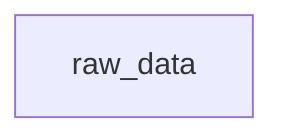

# Pipeline Tutorial

> A step-by-step guide to T's pipeline execution model

Pipelines are T's core execution model. They let you define named computation steps (nodes) that are automatically ordered by their dependencies, executed deterministically, and cached for re-use.

---

## 1. Your First Pipeline

A pipeline is a block of named expressions enclosed in `pipeline { ... }`:

```t
p = pipeline {
  x = 10
  y = 20
  total = x + y
}
```

This creates a pipeline with three nodes: `x`, `y`, and `total`. Each node is computed once, and the results are cached. Access any node's value with dot notation:

```t
p.x      -- 10
p.y      -- 20
p.total  -- 30
```

The pipeline itself displays as:

```
Pipeline(3 nodes: [x, y, total])
```

### 1.1 The Interactive Development Loop (Build, Inspect, Plot, and Extend)

A common and highly productive way to build T-Lang pipelines is incrementally, using an interactive REPL development loop. By starting small and iteratively building, inspecting, plotting, and extending, you ensure that each step of your data pipeline behaves as expected.

#### Step 1: Start with a Single Node

First, define a pipeline with a single root node. For example, loading some raw data:

```t
p = pipeline {
  raw_data = [1, 2, 3, 4, 5]
}
```

#### Step 2: Build the Pipeline

Build the pipeline to materialize the raw data node as a Nix artifact:

```t
build_pipeline(p)
```

During this build, Nix runs the computation (in this case, just returning the vector `[1, 2, 3, 4, 5]`) and caches it in the Nix store.

#### Step 3: Check, Inspect, and Verify

Once built, verify that the node was evaluated correctly:

- **Check value in-memory**: Access the node directly using dot notation:
  ```t
  p.raw_data
  -- [1, 2, 3, 4, 5]
  ```
- **Verify the serialized artifact**: Use `read_node()` to ensure the serialized value can be successfully read from the Nix store cache:
  ```t
  read_node(p.raw_data)
  -- [1, 2, 3, 4, 5]
  ```
- **Inspect build logs**: Check the latest build log to see the build execution time and status:
  ```t
  inspect_log()
  -- A DataFrame showing the derivation path and build status of "raw_data"
  ```
- **Explain diagnostics**: Call `explain()` to view properties and runtime environment information:
  ```t
  explain(p.raw_data)
  -- { `runtime`: "T", `kind`: "node", `name`: "raw_data", ... }
  ```

#### Step 4: Plot the DAG

Visualize the current topology of your pipeline. You can render the DAG directly in your web browser by calling `show_plot()` on the pipeline:

```t
show_plot(p)
```

Alternatively, you can convert the dependency graph to a Mermaid string to print or render in Markdown:

```t
print(pipeline_to_mermaid(p))
```

Output:


#### Step 5: Add Another Node

First, save your current pipeline state into `p_old` so you can diff it later:

```t
p_old = p
```

Now, extend your pipeline by adding a second node that depends on the first one. For example, calculating the sum of the raw data:

```t
p = pipeline {
  raw_data = [1, 2, 3, 4, 5]
  total = sum(raw_data)
}
```

#### Step 6: Build, Verify, and Plot Again

Re-build your extended pipeline:

```t
build_pipeline(p)
```

Because `raw_data` was already built and cached, Nix will automatically skip rebuilding it (a cache hit) and only compute the new `total` node! You can verify this cache hit behavior by running a cache-aware dry run first:

```t
plan = build_pipeline(p, dry_run = true)
print(plan)
-- DataFrame(2 rows x 3 cols: [node, action, store_path])
-- node       action       store_path
-- raw_data   cache_hit    /nix/store/...-raw_data
-- total      rebuild      /nix/store/...-total
```

After building, inspect the new node and dependency layout:

- **Verify the new node**:
  ```t
  p.total
  -- 15

  read_node(p.total)
  -- 15
  ```
- **Inspect the new DAG**: Plot the updated dependency graph to verify the relationship. You can open it in the browser:
  ```t
  show_plot(p)
  ```
  Or get the Mermaid source:
  ```t
  print(pipeline_to_mermaid(p))
  ```
  Output:
  ```mermaid
  graph TD
    raw_data --> total
  ```
- **Compare pipeline changes**: If you want to check what changed structurally since your last pipeline definition, you can use `pipeline_diff()`:
  ```t
  diff = pipeline_diff(p_old, p)
  print(diff.added_nodes)
  -- ["total"]
  ```

By following this loop—**Build ➔ Verify ➔ Plot ➔ Extend**—you can comfortably build up large, complex, and reliable data pipelines step by step.

---

## 2. Pipeline Function Quick Reference

A consolidated index of all pipeline reading, inspecting, and build-log functions. Use this as a cheatsheet to find the right tool for the job.

### Reading Node Artifacts

| Function | Parameters | Returns | What it does |
|---|---|---|---|
| `read_node(node)` | `ComputedNode` | deserialized value + diagnostics | Read in-scope pipeline node artifact |
| `read_past_node(p.name, which_log)` | NSE-captured node, `String` (required) | deserialized value + diagnostics | Read from historical build log without pipeline in scope |
| `read_pipeline(p)` | `Pipeline` | `Dict` | Per-node values + diagnostics + aggregated summary |
| `pipeline_node(p, name)` | `Pipeline`, `String` | `Any` | Value of a specific node by name |

### Build Logs & History

| Function | Parameters | Returns | What it does |
|---|---|---|---|
| `build_log(p, which_log?)` | `Pipeline`, optional `String` | `BuildLog` | Structured build log for latest (or specified) build |
| `build_log_to_frame(log)` | `BuildLog` | `DataFrame` | Build log as DataFrame (name, status, duration, path) |
| `build_log_history(p, n?, pattern?)` | `Pipeline`, optional `Int`, `String` | `DataFrame` | History of all builds matching pipeline's node signature |
| `list_logs()` | — | `DataFrame` | All log files in `_pipeline/` (filename, mtime, size, pipeline) |
| `inspect_log(p?, which_log?)` | optional `Pipeline`, optional `String` | `DataFrame` | Derivation-level build status (derivation, build_success, path) |
| `read_log(node_name)` | `String` | `String` | Raw Nix build log text for a specific node |

### Node Inspection & Diagnostics

| Function | Parameters | Returns | What it does |
|---|---|---|---|
| `inspect_node(node)` | `ComputedNode` | `Dict` | Static metadata (runtime, path, class, deps) + structured warnings |
| `warning_msg(node)` | `ComputedNode` | `String` | Formatted warning message (own + upstream with source prefix) |
| `collect_exceptions(p)` | `Pipeline` | `DataFrame` | Structured error/warning DataFrame from built pipeline |
| `suppress_warnings(val)` | `Any` | original value | Suppress console warnings for a node; still accessible via `warning_msg()` |
| `debug_node(node)` | `ComputedNode` | `NA` | Interactive REPL subshell pre-configured with node environment |
| `rebuild_node(node)` | `ComputedNode` | `ComputedNode` | Rebuild a single node and return updated artifact path |

### Pipeline DAG Structure

| Function | Parameters | Returns | What it does |
|---|---|---|---|
| `pipeline_to_frame(p)` | `Pipeline` | `DataFrame` | Full node metadata (runtime, serializer, deps, depth, command_type) |
| `pipeline_nodes(p)` | `Pipeline` | `List[String]` | All node names |
| `pipeline_deps(p)` | `Pipeline` | `Dict` | Node name → list of dependency names |
| `pipeline_edges(p)` | `Pipeline` | `List[[from, to]]` | Edge list as dependency pairs |
| `pipeline_roots(p)` | `Pipeline` | `List[String]` | Nodes with no dependencies |
| `pipeline_leaves(p)` | `Pipeline` | `List[String]` | Nodes that nothing depends on |
| `pipeline_depth(p)` | `Pipeline` | `Int` | Maximum topological depth |
| `pipeline_cycles(p)` | `Pipeline` | `List[String]` | Nodes involved in cycles (empty = valid) |
| `pipeline_validate(p)` | `Pipeline` | `List[String]` | Validation errors (empty = valid); checks missing deps + cycles |
| `pipeline_assert(p)` | `Pipeline` | `Pipeline` | Throws first error, or returns pipeline unchanged |
| `pipeline_print(p)` | `Pipeline` | `NA` | Pretty-print node table to stdout |
| `pipeline_to_dot(p)` | `Pipeline` \| `MetaPipeline` | `String` | Graphviz DOT representation |
| `pipeline_to_mermaid(p)` | `Pipeline` \| `MetaPipeline` | `String` | Mermaid flowchart diagram |
| `trace_nodes(p, name?)` | `Pipeline`, optional `String` | `NA` | Visual dependency tree printer |
| `pipeline_cache_status(p)` | `Pipeline` | `DataFrame` | Nix store cache hits per node (cached, store_path) |
| `pipeline_to_drv(p)` | `Pipeline` | `Dict` | Node → derivation (.drv) path mapping |
| `pipeline_to_store(p)` | `Pipeline` | `Dict` | Node → Nix store output path mapping |

### Node-Level Filtering & Diffs

| Function | Parameters | Returns | What it does |
|---|---|---|---|
| `select_node(p, ...)` | `Pipeline`, `Symbol`... | `DataFrame` | Column projection from `pipeline_to_frame` |
| `which_nodes(p, predicate)` | `Pipeline`, `Function` (NSE) | `List` | Node records from `read_pipeline(p).nodes` matching predicate |
| `errored_nodes(p)` | `Pipeline` | `List` | Convenience wrapper: nodes with non-NA `diagnostics.error` |
| `node_diff(a, b, log_a?, log_b?)` | `ComputedNode` ×2, optional `String`/`Int` | `VDict` | Compare node artifacts across builds |
| `pipeline_diff(a, b)` | `Pipeline` ×2 | `Dict` | Structural diff between two pipeline DAGs |

### Export / Import / GC

| Function | Parameters | Returns | What it does |
|---|---|---|---|
| `pipeline_copy(node?, target_dir?)` | optional `String`, `String` | `String` | Copy artifacts from Nix store to local directory |
| `export_artifacts(p, archive)` | `Pipeline`, `String` | `String` | Export cached artifacts to portable archive |
| `import_artifacts(target_or_archive, archive?)` | `Pipeline` or `String`, optional `String` | `String` | Import previously exported archive |
| `inspect_artifacts(archive)` | `String` | `DataFrame` | Preview archive contents without importing |
| `pipeline_gc(p, dry_run?)` | `Pipeline`, optional `Bool` | `DataFrame` | GC pipeline store paths (dry_run=true previews) |
| `t_gc()` | — | `String` | Global Nix garbage collection |

---

## 4. Explicit Node Configuration

In addition to bare assignments, you can explicitly configure nodes using the `node()` function. This lets you define the execution environment (like the `runtime`) and custom serialization methods for when a pipeline is materialized by Nix:

```t
p = pipeline {
  data = node(command = read_csv("data.csv"), runtime = T)
  
  -- Running a Python node that trains a model using the pyn wrapper
  model = pyn(
    command = <{
        from sklearn.linear_model import LinearRegression
        fit = LinearRegression().fit(X, y)
        fit
    }>,
    serializer = "pmml"
  )
}
```

Bare syntax (like `x = 10`) is automatically desugared to `x = node(command = 10, runtime = T, serializer = default, deserializer = default)`. You can also use `pyn()`, `rn()`, and `shn()` as shortcuts for Python, R, and shell runtimes. T enforces cross-runtime safety: if a node with a non-`T` runtime depends on a `T` node, or vice versa, you should specify an explicit `serializer`/`deserializer`.

When an R node returns a `ggplot2` object, a Python node returns a `matplotlib` / `plotnine` plot object, or a Julia node returns a `TidierPlots.jl`, `Plots.jl`, or `Makie.jl` figure object, T preserves lightweight plot metadata for REPL inspection. Reading or printing those artifacts shows a structured summary with the plot class (`ggplot`, `matplotlib`, `plotnine`, `tidierplots`, `plotsjl`, or `makie`), runtime backend (`R`, `Python`, or `Julia`), title, labels, mappings when available, and layer information instead of a raw runtime-specific object dump.

### Using the `script` Argument

Instead of inlining code with `command`, you can point a node to an external source file using the `script` argument. This works with `node()`, `pyn()`, `rn()`, and `shn()`. The `script` and `command` arguments are mutually exclusive.

```t
p = pipeline {
  -- Execute an external R script
  model = rn(script = "train_model.R", serializer = "pmml")

  -- Execute an external Python script
  predictions = pyn(script = "predict.py", deserializer = "pmml")

  -- Execute an external shell script
  report = shn(script = "postprocess.sh")

  -- node() auto-detects the runtime from the file extension
  summary = node(script = "summarise.R", serializer = "json")
}
```

When using `script`, the runtime is auto-detected from the file extension (`.R` → R, `.py` → Python, `.sh` → sh) if not explicitly set via the `runtime` argument. T reads the script file to extract identifier references, allowing the pipeline dependency graph to be built correctly from variables referenced in the external file.

### Shell / Bash nodes with `shn()`

Use `shn()` for pipeline steps that are easiest to express as shell or CLI commands. It is a convenience wrapper around `node(runtime = sh, ...)`, just like `rn()` and `pyn()` wrap `node()` for R and Python.

```t
p = pipeline {
  -- Exec-style shell node: command + positional argv
  fields = shn(
    command = "printf",
    args = ["first line\\nsecond line\\n"]
  )

  -- Script-style shell node: inline shell source executed with `sh`
  report = shn(command = <{
#!/bin/sh
set -eu

# Dependencies for T's lexical pipeline analysis: summary_r summary_py
printf 'R summary: %s\n' "$T_NODE_summary_r/artifact"
printf 'Python summary: %s\n' "$T_NODE_summary_py/artifact"
  }>)
}
```

There are two useful modes:

- **Exec mode**: provide a string `command` plus `args = [...]` to run a program directly with positional arguments.
- **Shell mode**: provide raw shell source with `<{ ... }>` or a `.sh` `script`, optionally overriding the interpreter with `shell = "bash"` and `shell_args = ["-lc"]` when you need Bash-specific syntax.

Shell nodes default to `serializer = text`, which makes them a good fit for reports, command output, and glue code between other pipeline nodes. For a full end-to-end example that mixes T, R, Python, and `sh`, see `tests/pipeline/polyglot_shell_pipeline.t` and `.github/workflows/polyglot-shell-pipeline.yml`.

---

## 4. Cross-Language Integration

T is designed to orchestrate code across multiple languages. The pipeline runner manages the serialization and deserialization of data between R, Python, and T using a first-class serializer system. For a deep dive into how T handles data interchange, see the [Serializers Documentation](serializers.md).

### Interchange Formats Comparison

| Format | Option | Best For | Requirement |
|---|---|---|---|
| **T Native** | `"default"` | T-to-T communication | None |
| **Arrow** | `"arrow"` | Large DataFrames | `pyarrow` (Py), `arrow` (R) |
| **PMML** | `"pmml"` | Predictive Models | `sklearn2pmml` (Py), `r2pmml` (R) |
| **JSON** | `"json"` | Simple lists/dicts | `jsonlite` (R) |

### Example: Training in R, Predicting in T

You can train a model in R and use T's native OCaml model evaluator to make predictions without leaving the T runtime:

```t
p = pipeline {
  -- Node 1: Train model in R using the rn wrapper
  model_r = rn(
    command = <{
      data <- read.csv("data.csv")
      lm(mpg ~ wt + hp, data = data)
    }>,
    serializer = "pmml"
  )
  
  -- Node 2: Predict in T using the R model
  predictions = node(
    command = <{
      test_df = read_csv("new_data.csv")
      predict(test_df, model_r)
    }>,
    runtime = "T",
    deserializer = "pmml"
  )
}
```

Setting `deserializer = "pmml"` on the T node tells the pipeline runner to use T's native PMML parser to convert the R model into a T model object.

---

## 5. Automatic Dependency Resolution

Nodes can be declared in **any order**. T automatically resolves dependencies:

```t
p = pipeline {
  result = x + y   -- depends on x and y
  x = 3            -- defined after result
  y = 7            -- defined after result
}
p.result  -- 10
```

T builds a dependency graph and executes nodes in topological order, so `x` and `y` are computed before `result` regardless of declaration order.

---

## 6. Chained Dependencies

Nodes can depend on other computed nodes, forming chains:

```t
p = pipeline {
  a = 1
  b = a + 1     -- depends on a
  c = b + 1     -- depends on b
  d = c + 1     -- depends on c
}
p.d  -- 4
```

---

## 7. Pipelines with Functions

Nodes can use any T function, including standard library functions:

```t
p = pipeline {
  data = [1, 2, 3, 4, 5]
  total = sum(data)
  count = length(data)
}
p.total  -- 15
p.count  -- 5
```

---

## 8. Pipelines with Pipe Operators

The pipe operator `|>` works naturally inside pipelines:

```t
double = \(x) x * 2

p = pipeline {
  a = 5
  b = a |> double
}
p.b  -- 10
```

### Error Recovery with Maybe-Pipe

The maybe-pipe `?|>` forwards all values — including errors — to the next function.
This is useful for building recovery logic into pipelines:

```t
recovery = \(x) if (is_error(x)) 0 else x
double = \(x) x * 2

p = pipeline {
  raw = 1 / 0                    -- Error: division by zero
  safe = raw ?|> recovery        -- forwards error to recovery → 0
  result = safe |> double        -- 0 |> double → 0
}
p.safe    -- 0
p.result  -- 0
```

Without `?|>`, the error from `raw` would short-circuit at `|>` and never reach `recovery`. The maybe-pipe lets you intercept errors and provide fallback values.

---

## 9. Data Pipelines

Pipelines are most powerful for data analysis workflows. Here's a complete example loading, transforming, and summarizing data:

```t
p = pipeline {
  data = read_csv("employees.csv")
  rows = data |> nrow
  cols = data |> ncol
  names = data |> colnames
}

p.rows   -- number of rows
p.cols   -- number of columns
p.names  -- list of column names
```

### Full Data Analysis Pipeline

```t
p = pipeline {
  raw = read_csv("sales.csv")
  filtered = filter(raw, $amount > 100)
  by_region = filtered |> group_by($region)
  summary = by_region |> summarize($total = sum($amount))
}

p.summary  -- DataFrame with regional totals
```

---

## 10. Pipeline Introspection

> [↩ Quick Reference: Reading Node Artifacts](#2-pipeline-function-quick-reference)

T provides functions to inspect pipeline structure:

### List all nodes

```t
p = pipeline { x = 10; y = 20; total = x + y }
pipeline_nodes(p)  -- ["x", "y", "total"]
```

### View dependency graph

```t
pipeline_deps(p)
-- {`x`: [], `y`: [], `total`: ["x", "y"]}
```

### Access a specific node by name

```t
pipeline_node(p, "total")  -- 30
```

---

## 11. Re-running Pipelines

Use `pipeline_run()` to re-execute a pipeline:

```t
p2 = pipeline_run(p)
p2.total  -- 30 (re-computed)
```

Re-running produces the same results — T pipelines are deterministic.

---

## 12. Deterministic Execution

Two pipelines with the same definitions always produce the same results:

```t
p1 = pipeline { a = 5; b = a * 2; c = b + 1 }
p2 = pipeline { a = 5; b = a * 2; c = b + 1 }
p1.c == p2.c  -- true
```

---

## 13. Error Handling & Resilience

### Errors are Values

In T, errors are **first-class values**. By default, evaluation is **resilient**: if a node fails, it produces an `Error` value instead of crashing the pipeline. This allows other independent nodes to continue building, giving you a full picture of which parts of your DAG are healthy.

```t
p = pipeline {
  a = 1 / 0      -- Produces an Error(DivisionByZero)
  b = 1 + 1      -- Still succeeds! (2)
  c = a + 1      -- Fails because 'a' is an error (Error)
}
```

When you print or build this pipeline, T provides a summary of which nodes succeeded and which failed.

### The `--failfast` Flag

If you prefer the usual, common behaviour where evaluation stops immediately at the first error, you can use the `--failfast` flag:

```bash
$ t run --failfast src/pipeline.t
```

In your T scripts, you can also opt-in to this behavior via `t_make()`:

```t
t_make(failfast = true)
```

### Cycle Detection

T detects circular dependencies and reports them at construction time, before any nodes are executed:

```t
pipeline {
  a = b
  b = a
}
-- Error(ValueError: "Pipeline has a dependency cycle involving node 'a'")
```

### Missing Nodes

Accessing a non-existent node returns a structured error:

```t
p = pipeline { x = 10 }
p.nonexistent
-- Error(KeyError: "node 'nonexistent' not found in Pipeline")
```

---

## 14. Materializing Pipelines

> [↩ Quick Reference: Reading Node Artifacts](#2-pipeline-function-quick-reference)

Defining a pipeline with `pipeline { ... }` evaluates nodes in-memory. To **materialize** them as reproducible Nix artifacts (potentially using R or Python dependencies you've defined in `tproject.toml`), use `populate_pipeline()` with the `build = true` argument:

```t
p = pipeline {
  data = read_csv("sales.csv")
  total = sum(data.$amount)
}

populate_pipeline(p, build = true)
```

`populate_pipeline(p, build = true)` is the primary command for materializing a pipeline. It does the following:

1. **Populates** the `_pipeline/` directory with `pipeline.nix` and `dag.json`.
2. **Generates** a Nix expression with one derivation per node. Crucially, if you define `[r-dependencies]` or `[py-dependencies]` in your `tproject.toml`, pipeline nodes have access to these language environments!
3. **Triggers** a Nix build to materialize each node as a serialized artifact.
4. **Records** the build in a timestamped log file (`_pipeline/build_log_YYYYMMdd_HHmmss_hash.json`).

> [!NOTE]
> `build_pipeline(p)` is available as a shorthand for `populate_pipeline(p, build = true)`.

### Reading built artifacts

After building, use `read_node()` to retrieve materialized values:

```t
read_node(p.total)   -- reads the serialized artifact for "total"
```

These functions look up the node in the **latest build log** and deserialize the artifact.

---

## 15. Orchestrating with populate_pipeline()

For more control over the build process, T provides `populate_pipeline()`. This function prepares the pipeline infrastructure without necessarily triggering the Nix build immediately.

```t
populate_pipeline(p)                -- Prepares _pipeline/ only
populate_pipeline(p, build = true)  -- Same as build_pipeline(p)
```

> [!TIP]
> For advanced configuration and passing low-level arguments directly to the underlying Nix build system (such as concurrency, targeted nodes, custom binary caches, dry runs, and force rebuilds), see the comprehensive [Nix Build Options & Orchestration](nix-options.html) guide.

### The `_pipeline/` directory

T maintains a persistent state directory for your pipeline. When you populate or build, T creates:

- **`_pipeline/pipeline.nix`**: The generated Nix expression for your pipeline nodes.
- **`_pipeline/dag.json`**: A machine-readable dependency graph of your pipeline.
- **`_pipeline/build_log_*.json`**: History of previous successful builds.

---

## 16. Build Logs and Time Travel

> [↩ Quick Reference: Build Logs & History](#2-pipeline-function-quick-reference)

T keeps a history of your builds in `_pipeline/`. This enables **Time Travel** — the ability to read artifacts from specific past versions of your pipeline.

### Structured Build Logs

When a pipeline is materialized via `build_pipeline(p)` (or `populate_pipeline(p, build=true)`), T generates a JSON log of the build. You can programmatically access these log files as first-class `VBuildLog` records in your T scripts using `build_log()`:

```t
p = pipeline { a = 1; b = a + 1 }
build_pipeline(p)

log = build_log(p)
log.duration          -- The total wall-clock time in seconds
log.failed_nodes      -- A list of node names that failed
log.nodes             -- A list of dicts with node name, status, and duration
```

You can easily convert this structured log into an Arrow DataFrame for programmatic inspection using `build_log_to_frame()`:

```t
build_log_to_frame(log)
-- DataFrame(2 rows x 3 cols: [name, status, duration])
```

If you want to retrieve the actual exceptions and warnings that occurred during the build, use `collect_exceptions()`:

```t
collect_exceptions(p)
-- A DataFrame detailing exceptions and warnings with columns: node, status, code, message.
```

Calling the built-in `explain()` function on the DataFrame returned by `collect_exceptions(p)` provides intelligent diagnostic feedback tailored to the number of exceptions present:
- **Single Exception**: If there is exactly one row in the exception DataFrame, `explain()` directly maps to it, outputting a structured explanation of the failure or warning (including the originating node name, diagnostic code, and description message).
- **Multiple Exceptions**: If there are zero or multiple rows, `explain()` returns an overarching `exceptions_list` dictionary showing the summary counts and a list mapping the individual structured explanation of each captured warning and error.

#### Build Verbosity and Failed Build Resiliency

By default, T builds are **quiet and minimalist** (`verbose = 0`), outputting only high-level status lines (e.g. `  + node_a building`, `  ✖ node_a failed`) without dumping detailed derivation logs or tracebacks to the terminal on failure.

Even if a build fails, **the build log is written unconditionally** to the `_pipeline/` directory. This allows you to inspect the build status, retrieve exact error tracebacks, and parse warnings for all nodes. Furthermore, the pipeline variable (e.g., `p`) remains fully bound in the REPL; successfully compiled nodes can still be queried, while failed nodes can be diagnosed programmatically using `collect_exceptions(p)` and `explain()`.

To stream detailed error tracebacks/logs directly to the terminal when a node fails, pass `verbose = 1` to the build or orchestrator:

```t
build_pipeline(p, verbose = 1)
```

Similarly, from the CLI or REPL:

```t
t_make(verbose = 1)
```


### Inspecting logs
Use `list_logs()` to see available build logs:

```t
logs = list_logs()
-- DataFrame of build logs with filename, modification_time, and size_kb
```

Use `inspect_log()` to view the build status of a specific pipeline as a DataFrame (defaults to the latest):

```t
inspect_log()
-- DataFrame(5 rows x 4 cols: [derivation, build_success, path, output])

inspect_log(which_log = "20260221_143022")
```

### Reading from a specific build

Use `read_past_node(p.node_name, which_log = "...")` to read from a specific historical build without the pipeline being in scope. Pass a regex pattern or filename to `which_log`:

```t
-- Read the latest version (pipeline must be in scope)
val = read_node(p.result)

-- Read from a specific historical build (works cold)
val_old = read_past_node(p.result, which_log = "20260221_143022")
```

This ensures that even as you update your code and data, you can always recover and compare results from previous runs.

### Temporal Introspection: History and Diffs

To reason about how your pipeline's outputs have evolved across iterative development (like tuning models, updating serializers, or changing data sources), T provides `build_log_history()`, `node_diff()`, and `pipeline_diff()`.

#### Comparing builds

A common workflow is to rebuild the same pipeline after changing a node and then compare the new artifact against an earlier build. `node_diff()` returns a structured `VDiff` envelope with `kind`, `identical`, `summary`, `detail`, and `hunks`, so you can inspect both the high-level counts and the raw changed regions.

```t
-- Compare the same node across two historical builds
d = node_diff(p.clean_data, p.clean_data,
      log_a = "20260510_120000",
      log_b = "20260515_090000",
      key = [$customer_id])

d.kind
d.identical
d.summary
d.hunks
```

Use `pipeline_diff()` when you want to compare pipeline structure rather than artifact contents. It reports added, removed, changed, and rewired nodes, and includes `pipeline_to_frame()` snapshots for both sides.

```t
struct_diff = pipeline_diff(p_before, p_after)
struct_diff.added_nodes
struct_diff.changed_nodes
struct_diff.rewired_edges
```

#### Pipeline Build History (`build_log_history`)

`build_log_history(p, n = NA, pattern = NA)` returns a summary DataFrame of all historical builds matching the current pipeline's node signature, ordered from most recent to oldest.

```t
-- Get full build history for pipeline p
history = build_log_history(p)

-- Limit history to the last 3 matching builds
history_limit = build_log_history(p, n = 3)

-- Filter historical builds whose filenames match a regex pattern
history_filtered = build_log_history(p, pattern = ".*train.*")
```

The resulting DataFrame is structured with the following columns:
- `build_id`: 1-indexed rank from most recent to oldest (where `1` is the latest, `2` is the second latest, etc.).
- `timestamp`: UTC ISO-8601 build timestamp string.
- `duration`: Total wall-clock duration of the build in seconds.
- `n_nodes` / `n_failed` / `n_warnings`: Summary metrics of node counts, failures, and warnings in that build.
- `out_path`: Nix store output root path of the build.
- `hash`: Content signature hash.

#### Type-Sensitive Node Diffs (`node_diff`)

`node_diff()` compares two node artifacts and chooses a type-specific diff automatically:

1. **DataFrames** return row and schema summaries plus DataFrame-valued `detail` sections for added, removed, and changed rows.
2. **Models** return coefficient and fit-stat deltas, including a `coef_diff` DataFrame.
3. **Scalars** return before/after values and a numeric delta when one exists.
4. **Python-native objects** (for example pickled NumPy ndarrays) are loaded through the bundled `tlang` Python package and compared through stable JSON rendering plus a git-like unified diff.
5. **Julia-native objects** (for example `Serialization.serialize`d arrays or structs) are loaded through the bundled `tlang` Julia package and compared with DeepDiffs.
6. **R-native objects** (for example `.rds` artifacts) are loaded through the bundled `tlang` R package and compared with `diffobj`.
7. **Generic values** fall back to structural string diffs while preserving the original values in `detail`.

Native Python, Julia, and R object diffs are preserved only for artifacts built
with the standard `default` or `tobj` serializers. If you assign a custom
serializer name, `node_diff()` uses the normal artifact-loading path instead;
call the companion helper package directly when you need a custom deserializer
for a native object. Julia-native comparisons currently start a fresh Julia
helper process for each diff, so repeated large diffs will include startup cost.

```t
-- 1. Compare scalar value shifts between latest and second latest builds
diff_scalar = node_diff(p.a, p.a)
diff_scalar.summary.changed  -- true/false
diff_scalar.summary.delta    -- numeric shift

-- 2. Compare DataFrame schema and drift metrics
diff_df = node_diff(p.my_dataset, p.my_dataset, log_a = 1, log_b = 2)
diff_df.summary.cols_added
diff_df.detail.changed

-- 3. Compare models across explicit historical builds or regex-matched logs
diff_model = node_diff(p.model_node, p.model_node, log_a = ".*test1.*", log_b = ".*test2.*")
diff_model.detail.coef_diff
```

#### Interactive REPL Diffs & Colorization

When working interactively inside the REPL, T provides first-class visual formatting for `VDiff` results:
- **Automatic Summary & Colorized Diff Preview**: If you print or evaluate a non-identical `VDiff` envelope (e.g. `diff_df`), the REPL prints the summary metrics followed by a short, colorized git-like preview of the diff, then points you to the full diff string.
- **Direct String Colorization**: Accessing `diff_df.detailed_diff` directly prints the raw, colorized git-like diff as a beautifully readable multiline block.
- **Key Validation**: When using a custom natural key list (e.g., `key = [$customer_id]`), `node_diff` strictly validates that all requested key columns exist in both schemas. If there is a typo or missing column, it returns a clean, native `ValueError` immediately rather than silently keeping only one row per side.

#### Inspecting Diffs in a Text Editor

For very large diffs, printing to the console may be hard to scroll. You can write the unified diff directly to a text file for inspection using a text editor (e.g., VSCode, Vim, or Emacs) using the standard `write_text` builtin:

```t
-- 1. Compute the DataFrame diff
diff_df = node_diff(p3.data, p2.data, key = [$id])

-- 2. Write the detailed unified diff string to a file on disk
write_text("dataframe_changes.diff", diff_df.detailed_diff)
```

---

## 17. Execution Modes

T enforces a clear separation between interactive and non-interactive execution:

### Non-interactive (`t run`)

Scripts executed with `t run` **must** call `populate_pipeline()` (or `build_pipeline()`). This ensures that non-interactive execution always produces reproducible Nix artifacts. By default, `t run` operates in **resilient mode**, continuing past errors to provide a full diagnostic summary. Use `--failfast` to change this.

```bash
# ✅ This works — resilient by default
$ t run my_pipeline.t

# 🛑 This fails immediately on the first error
$ t run --failfast my_pipeline.t

# ❌ This is rejected — script doesn't call populate_pipeline()
$ t run my_script.t
# Error: non-interactive execution requires a pipeline.
# Use --unsafe to override.
```

A valid pipeline script looks like:

```t
-- my_pipeline.t
p = pipeline {
  data = read_csv("input.csv")
  result = data |> filter($value > 0) |> summarize(total = sum($value))
}

populate_pipeline(p, build = true)
```

### Interactive (REPL)

The REPL is **unrestricted** — you can run any T code line by line, whether or not it involves pipelines:

```bash
$ t repl
T> x = 1 + 2
T> print(x)
3
T> p = pipeline { a = 10 }
T> p.a
10
```

---

## 18. Using Imports in Pipelines

When a pipeline is built with `build_pipeline()`, each node runs inside a **Nix sandbox** — an isolated build environment. Import statements from your script are **automatically propagated** into each sandbox, so imported packages and functions are available to all nodes.

```t
-- pipeline.t
import my_stats
import data_utils[read_clean, normalize]

p = pipeline {
  raw = read_csv("data.csv")
  clean = read_clean(raw)              -- uses imported function
  normed = normalize(clean)            -- uses imported function
  result = weighted_mean(normed.$x, normed.$w)  -- uses imported function
}

build_pipeline(p)
```

When `build_pipeline(p)` generates the Nix derivation for each node, it prepends the import statements:

```t
-- Generated node_script.t (inside Nix sandbox)
import my_stats
import data_utils[read_clean, normalize]
raw = deserialize("$T_NODE_raw/artifact.tobj")
result = weighted_mean(raw.$x, raw.$w)
serialize(result, "$out/artifact.tobj")
```

All three import forms are supported:

| Syntax | Effect |
|---|---|
| `import "src/helpers.t"` | Import a local file |
| `import my_stats` | Import all public functions from a package |
| `import my_stats[foo, bar]` | Import specific functions |
| `import my_stats[wm=weighted_mean]` | Import with aliases |

---

## 19. Using explain() with Pipelines

The `explain()` function provides structured metadata about pipelines:

```t
p = pipeline {
  x = 10
  y = x + 5
  z = y * 2
}

e = explain(p)
e.kind        -- "pipeline"
e.node_count  -- 3
```

---

## 20. Skipping Nodes

You can explicitly skip a node (and by extension, all nodes that depend on it) by passing the `noop = true` argument to the `node()` function.

```t
p = pipeline {
  raw_data = read_csv("raw.csv")
  
  # This node and its dependencies won't trigger a heavy Nix build
  expensive_model = rn(
    command = train(raw_data),
    noop = true
  )

  # This node depends on expensive_model, therefore it becomes a noop as well
  report = rn(command = generate_report(expensive_model))
}

populate_pipeline(p, build = true)
```

In a Nix sandbox context, `noop` generates a lightweight stub instead of a real build derivation.

---

## 21. Node Metadata

> [↩ Quick Reference: Pipeline DAG Structure](#2-pipeline-function-quick-reference)

Every node in a pipeline carries structured metadata that you can query and manipulate. The `pipeline_to_frame()` function converts this metadata into a DataFrame with one row per node.

### `pipeline_to_frame`

```t
p = pipeline { a = 1; b = a + 1; c = b + 1 }
pipeline_to_frame(p)
-- DataFrame(3 rows x 8 cols: [name, runtime, serializer, deserializer, noop, deps, depth, command_type])
```

The columns returned are:

| Column | Type | Description |
|---|---|---|
| `name` | String | Unique node identifier |
| `runtime` | String | `"T"`, `"R"`, `"Python"`, or `"Julia"` |
| `serializer` | String | e.g. `"default"`, `"pmml"` |
| `deserializer` | String | e.g. `"default"`, `"pmml"` |
| `noop` | Bool | Whether the node is a no-op |
| `deps` | String | Comma-separated dependency names |
| `depth` | Int | Topological depth (roots = 0) |
| `command_type` | String | `"command"` or `"script"` |

`pipeline_to_frame` is the foundation for inspection: you can use T's standard `filter`, `select`, and `arrange` verbs on the resulting DataFrame.

### `select_node`

`select_node` returns a DataFrame with only the columns you request, using NSE `$field` references:

```t
p = pipeline {
  a = 1
  b = node(command = <{ 2 }>, runtime = R, serializer = "pmml")
  c = b + 1
}

p |> select_node($name, $runtime, $depth)
-- DataFrame: name="a", runtime="T", depth=0
--            name="b", runtime="R", depth=0
--            name="c", runtime="T", depth=1
```

Available fields: `$name`, `$runtime`, `$serializer`, `$deserializer`, `$noop`, `$deps`, `$depth`, `$command_type`.

---

## 22. Environment Variables

Pipeline nodes can pass environment variables into the Nix build sandbox via the `env_vars` named argument on `node()`, `py()`/`pyn()`, and `rn()`. This allows nodes to configure their build-time execution environment without embedding those values directly into the command body.

```t
p = pipeline {
  model = rn(
    command = <{ train_model(data) }>,
    env_vars = [
      MODEL_MODE: "train",
      RETRIES: 2,
      DEBUG: true
    ]
  )
}
```

### Supported Types

The `env_vars` dictionary supports the following scalar-like values:

| Type | Example | Nix Output |
|---|---|---|
| **String** | `"train"` | `"train"` |
| **Symbol** | `train` | `"train"` |
| **Int** | `2` | `"2"` |
| **Float** | `3.14` | `"3.14"` (up to 15 significant digits) |
| **Bool** | `true` | `"true"` |
| **NA** | `NA` | (Omitted from derivation) |

### Validation

T performs early validation on environment variables:
- `env_vars` must be a dictionary.
- Unsupported types (like Lists or nested Dicts) trigger a structured type error during pipeline construction.
- `NA` values are silently omitted from the generated Nix derivation instead of being materialized as empty strings.

These variables are automatically threaded into the generated `stdenv.mkDerivation` and are available via standard system methods (e.g., `Sys.getenv()` in R or `os.environ` in Python) during the Nix build step.

---

## 23. Node-Level Operations (`_node` family)


T provides a set of colcraft-style verbs for operating on pipeline nodes. These mirror the DataFrame API, using NSE `$field` references for node metadata fields.

### `filter_node`

Returns a new pipeline containing only the nodes where the predicate is true. No DAG validity check is performed — if a retained node references a removed node, that surfaces at `build_pipeline` time.

```t
p = pipeline {
  load   = read_csv("data.csv")
  model  = rn(command = <{ lm(y ~ x, data = load) }>, serializer = "pmml")
  score  = node(command = predict(model, load), deserializer = "pmml")
}

-- Keep only R nodes
p |> filter_node($runtime == "R") |> pipeline_nodes
-- ["model"]

-- Keep only nodes with no noop flag
p |> filter_node($noop == false) |> pipeline_nodes

-- Keep only shallow nodes (root and depth-1 nodes)
p |> filter_node($depth <= 1) |> pipeline_nodes
```

### `which_nodes`

`filter_node` rewrites the pipeline itself. `which_nodes` is the read-only counterpart: it filters the richer node records you would otherwise have to access manually through `read_pipeline(p).nodes`.

This is especially useful for diagnostics queries because each record includes `name`, `value`, and `diagnostics`.

```t
p = pipeline {
  bad = 1 / 0
  ok = 42
  downstream = bad + 1
}

-- Keep only nodes with captured errors
which_nodes(p, !is_na(diagnostics.error))

-- Same idea, but return only the node names
which_nodes(p, !is_na(diagnostics.error))
  |> map(\(node) node.name)
-- ["bad", "downstream"]

-- Explicit predicate functions still work too
has_error = \(node) !is_na(node.diagnostics.error)
which_nodes(p, has_error)

-- Convenience shortcut for the most common case
errored_nodes(p) |> map(\(node) node.name)
```


### `mutate_node`

Modifies metadata fields on all nodes, or scoped to a subset using the `where` argument:

```t
-- Mark all nodes as noop
p |> mutate_node($noop = true)

-- Mark only R nodes as noop (useful for skipping heavy computations)
p |> mutate_node($noop = true, where = $runtime == "R")

-- Override serializer for all nodes
p |> mutate_node($serializer = "pmml", where = $runtime == "R")
```

Mutable metadata fields: `noop` (Bool), `runtime` (String), `serializer` (String), `deserializer` (String).

### `rename_node`

Renames a single node and automatically rewires all dependency edges that referenced the old name. This is the canonical way to resolve name collisions before set operations like `union`.

```t
p = pipeline { a = 1; b = a + 1 }

p2 = p |> rename_node("a", "alpha")
pipeline_nodes(p2)   -- ["alpha", "b"]
pipeline_deps(p2)    -- {`alpha`: [], `b`: ["alpha"]}
```

Attempting to rename to a name that already exists is an error:

```t
p |> rename_node("a", "b")
-- Error(ValueError: "A node named `b` already exists in the Pipeline.")
```

### `arrange_node`

Returns a new pipeline with nodes sorted by a metadata field. This affects only display/serialization order — the DAG determines execution order.

---

## 24. Pipeline Manipulation for Data Scientists

Beyond basic execution, T allows you to treat a Pipeline as a queryable and mutable data structure. This is powerful for meta-programming, automated reporting, and "surgical" updates to large analysis graphs.

### Finding Errored Nodes Programmatically
In a production setting, you may want to extract the errors from a failed pipeline run to log them or send an alert.

```t
p = build_pipeline(p)

-- Get detailed records for all failed nodes
failed_records = errored_nodes(p)

-- Extract just the names and error messages
errors = map(failed_records, \(n) [name: n.name, msg: n.diagnostics.error])
```

### Filtering Subgraphs
If you have a massive pipeline but only want to visualize or re-run a specific subset (e.g., all Python nodes), use `filter_node()`:

```t
-- Create a subgraph of only Python-based computations
py_pipeline = p |> filter_node($runtime == "Python")

-- Create a subgraph of 'shallow' nodes (roots and their immediate children)
shallow_p = p |> filter_node($depth <= 1)
```

### Surgical Reconfiguration
Lenses allow you to modify a pipeline specification without using the `pipeline { ... }` block again. This is useful for "what-if" analysis or dynamic configuration.

```t
-- 1. Identify a node to skip
noop_l = node_meta_lens("heavy_computation", "noop")

-- 2. Toggle the noop flag surgically
p_fast = p |> set(noop_l, true)

-- 3. Swap a runtime for testing
p_test = p |> set(node_meta_lens("model_train", "runtime"), "R")
```

### Inspecting Node Results with Lenses
If you have a `VPipeline` object (from `read_pipeline()`), you can use lenses to safely extract values from specific nodes.

```t
p_info = read_pipeline(p)

-- Focus on the 'summary' node's value
summary_l = node_lens("summary")
summary_df = get(p_info, summary_l)
```

```t
p = pipeline { z = 1; a = 2; m = 3 }

p |> arrange_node($name) |> pipeline_nodes       -- ["a", "m", "z"]
p |> arrange_node($name, "desc") |> pipeline_nodes -- ["z", "m", "a"]

-- Sort a chain by depth (shallowest first)
p = pipeline { a = 1; b = a + 1; c = b + 1 }
p |> arrange_node($depth) |> pipeline_nodes      -- ["a", "b", "c"]
```

---

## 24. Set Operations

Pipelines can be treated as named sets of nodes. T provides four set operations that combine or subtract pipelines.

> **Immutability**: All set operations return new Pipelines. The original pipelines are never modified.
>
> **Lazy validation**: Set operations do not check DAG validity. If the result has dangling references, errors surface at `build_pipeline` or `pipeline_run` time.

### `union`

Merges two pipelines, including all nodes from both. Errors immediately on any name collision. Use `rename_node` to resolve collisions first.

```t
p_etl = pipeline {
  raw   = read_csv("data.csv")
  clean = raw |> filter($value > 0)
}

p_model = pipeline {
  fit    = lm(clean, formula = y ~ x)
  report = summary(fit)
}

p_full = p_etl |> union(p_model)
pipeline_nodes(p_full)  -- ["raw", "clean", "fit", "report"]
```

If both pipelines have a node named `clean`:

```t
p_etl |> union(p_model)
-- Error(ValueError: "Function `union`: name collision(s) detected: clean. Use `rename_node` to resolve.")

-- Fix: rename before merging
p_model2 = p_model |> rename_node("clean", "clean_model")
p_etl |> union(p_model2)
```

---

## 25. Diagnostic Suppression

Nodes that produce large numbers of non-terminal warnings (like those from `filter()` or complex modeling functions) can be silenced using the `suppress_warnings` combinator. This silences the console output for a node while maintaining the warning records for auditability.

```t
p = pipeline {
  -- High-noise node with suppressed warnings
  filtered = to_dataframe([[x: 1], [x: NA], [x: 3]]) 
    |> filter($x > 1) 
    |> suppress_warnings

  -- Downstream node remains unaffected
  count = nrow(filtered)
}
```

When building or running a pipeline with suppressed nodes, the summary reflects this state:

```
Pipeline summary: 1 node(s) with warnings, 1 suppressed, 0 error(s)
  ○  filtered — warnings suppressed by caller (1 NAs ignored)
```

The `○` symbol indicates a suppressed node. You can still access the underlying warning objects programmatically via `warning_msg()` or `read_pipeline()`.

```t
warning_msg(p.filtered)               -- Returns the warning message string
read_pipeline(p).diagnostics.summary  -- Summary counts
```

### `difference`

Removes from the first pipeline all nodes whose names appear in the second pipeline. Nodes in the second pipeline that don't exist in the first are silently ignored.

```t
p = pipeline { a = 1; b = 2; c = 3; d = 4 }
p_remove = pipeline { b = 0; d = 0 }

p |> difference(p_remove) |> pipeline_nodes  -- ["a", "c"]
```

### `intersect`

Retains only nodes present by name in both pipelines, using definitions from the first pipeline.

```t
p1 = pipeline { a = 1; b = 2; c = 3 }
p2 = pipeline { b = 99; c = 100; d = 4 }

p1 |> intersect(p2) |> pipeline_nodes  -- ["b", "c"] (p1's definitions)
```

### `patch`

Like `union`, but only updates nodes that already exist in the first pipeline — it will not add new nodes from the second pipeline. Ideal for overriding configurations without accidentally importing stray nodes.

```t
p_prod = pipeline {
  load  = read_csv("data.csv")
  model = rn(command = <{ lm(y ~ x, data = load) }>, serializer = "pmml")
}

p_overrides = pipeline {
  model = rn(command = <{ lm(y ~ x + z, data = load) }>, serializer = "pmml")
  extra = 99  -- stray node
}

p_updated = p_prod |> patch(p_overrides)
pipeline_nodes(p_updated)  -- ["load", "model"] — "extra" was not added
```

---

## 25. DAG-Aware Transformations

These operations are structurally aware of the pipeline's dependency graph and are used to replace node implementations, reroute edges, and extract subgraphs.

### `swap`

Replaces a node's implementation while preserving its existing dependency edges. The new node is specified as the third argument.

```t
p = pipeline {
  data  = read_csv("data.csv")
  model = rn(command = <{ lm(y ~ x, data = data) }>, serializer = "pmml")
  score = node(command = predict(model, data), deserializer = "pmml")
}

-- Replace the model node with a new implementation; edges to/from model are preserved
new_model = rn(command = <{ glm(y ~ x, data = data, family = binomial) }>, serializer = "pmml")
p2 = p |> swap("model", new_model)

pipeline_deps(p2)
-- `model` still depends on `data`, and `score` still depends on `model`
```

### `rewire`

Reroutes a node's declared dependencies. The `replace` argument maps old dependency names to new ones. Only the named node's dependency list is updated.

```t
p = pipeline {
  data    = read_csv("data.csv")
  data_v2 = read_csv("data_v2.csv")
  model   = rn(command = <{ lm(y ~ x, data) }>, serializer = "pmml")
}

-- Re-point model to use data_v2 instead of data
p2 = p |> rewire("model", replace = list(data = "data_v2"))
pipeline_deps(p2)
-- {`data`: [], `data_v2`: [], `model`: ["data_v2"]}
```

### `prune`

Removes all leaf nodes — nodes that nothing else depends on. This is useful for cleaning up intermediate pipelines after `filter_node` or `difference` operations that may leave orphaned utility nodes.

```t
p = pipeline { a = 1; b = a + 1; c = 3 }
-- `a` is depended on by `b`, so it is not a leaf.
-- `b` depends on `a` but nothing depends on `b` — it is a leaf.
-- `c` is independent and nothing depends on it — it is also a leaf.

p |> prune |> pipeline_nodes  -- ["a"] (both b and c are leaves, removed)
```

You can chain `difference` and `prune` to strip unwanted branches in one step:

```t
p_partial = p |> difference(p_debug_nodes) |> prune
```

### `upstream_of`

Returns a new pipeline containing the named node and all its transitive ancestors (everything the node depends on, directly or indirectly).

```t
p = pipeline {
  raw     = read_csv("data.csv")
  clean   = raw |> filter($value > 0)
  model   = rn(command = <{ lm(y ~ x, clean) }>, serializer = "pmml")
  report  = summary(model)
  sidebar = "metadata"
}

-- Everything needed to produce `model`
p |> upstream_of("model") |> pipeline_nodes  -- ["raw", "clean", "model"]
-- sidebar is excluded because model doesn't depend on it
```

### `downstream_of`

Returns a new pipeline containing the named node and all nodes that transitively depend on it (everything that uses this node, directly or indirectly).

```t
-- Everything that is affected if `clean` changes
p |> downstream_of("clean") |> pipeline_nodes  -- ["clean", "model", "report"]
-- raw and sidebar are excluded
```

### `subgraph`

Returns the full connected component of a node — the union of its ancestors and descendants.

```t
p = pipeline { a = 1; b = a + 1; c = b + 1; d = 99 }

-- Everything connected to b (upstream and downstream)
p |> subgraph("b") |> pipeline_nodes  -- ["a", "b", "c"] — d is disconnected
```

---

## 26. Pipeline Composition

These higher-level operators combine two complete, separately-defined pipelines into one.

### `chain`

Connects two pipelines where the second pipeline's nodes reference node names from the first as dependencies. T verifies that at least one such shared reference exists; if the two pipelines are completely disconnected, `chain` raises an error.

```t
p_etl = pipeline {
  raw   = read_csv("data.csv")
  clean = raw |> filter($value > 0)
}

-- p_model references `clean` from p_etl — this is the wire
p_model = pipeline {
  fit    = lm(clean, formula = y ~ x)
  report = summary(fit)
}

p_full = p_etl |> chain(p_model)
pipeline_nodes(p_full)  -- ["raw", "clean", "fit", "report"]
```

`chain` is stricter than `union`: it requires an *intent* to connect the pipelines, catching accidental merges where no wiring was meant.

### Meta-Pipelines (`pipeline_of`)

For larger projects, you can compose multiple pipelines into a higher-order DAG using the `pipeline_of` block. T-Lang natively understands and automatically flattens meta-pipelines at execution time, meaning you can pass them directly to built-in commands like `populate_pipeline()`, `read_node()`, `inspect_node()`, or `inspect_pipeline()`.

#### `pipeline_of` block

Defines a group of sub-pipelines. The nodes within the block bind identifiers to pipeline values.

```t
p_etl = pipeline {
  raw   = read_csv("data.csv")
  clean = raw |> filter($value > 0)
}

p_stats = pipeline {
  summary = etl.clean |> mean
}

-- Compose them into a higher-order DAG
meta = pipeline_of {
  etl   = p_etl
  stats = p_stats
}
```

#### Automatic Dependency Inference

T-Lang automatically analyzes cross-pipeline references in node expressions (such as referencing `etl.clean` in the `stats` pipeline) to infer the execution order between sub-pipelines. The flattening engine automatically wires the root nodes of a dependent sub-pipeline to depend on the terminal nodes of the pipeline it references.


#### Native Execution & Namespacing

When a meta-pipeline is populated, queried, or inspected, T-Lang automatically flattens it internally. Node names are automatically namespaced (e.g. `etl.raw`, `etl.clean`, `stats.summary`) to prevent namespace collisions, and all internal variable references are rewritten accordingly.

```t
pipeline_nodes(meta)
-- ["etl.raw", "etl.clean", "stats.summary"]

pipeline_deps(meta)
-- {`etl.raw`: [], `etl.clean`: ["etl.raw"], `stats.summary`: ["etl.clean"]}

-- You can build the entire meta-pipeline directly:
populate_pipeline(meta, build = true)

-- You can read individual nodes using nested dot notation:
res = read_node(meta.stats.summary)
```

### Cross-Pipeline Dependency Tracking: T vs. RawCode

T's dependency tracking works differently depending on the node's runtime. This leads to a specific limitation when using `chain()` with R or Python pipelines.

#### How T Detects Dependencies
- **T Expressions**: T has a full understanding of its own syntax. When you use a variable that isn't defined inside the pipeline (and isn't in your global environment), T knows for certain it is an external dependency.
- **RawCode (<{ ... }>)**: For R and Python, T uses a fast **lexical heuristic** (scanning for words) to find dependencies. It cannot reliably distinguish between a foreign function (like `lm()`) and a T variable from a different pipeline.

#### The Limitation
To avoid polluting your build environment with R/Python functions as Nix dependencies, T **ignores** external references inside RawCode blocks when they are not defined in the current pipeline block.

**This means `chain()` will fail to automatically wire R/Python nodes to nodes in other pipelines.**

#### The Solution: The T-Stub Workaround
If you need an R or Python node to depend on a node from a separate pipeline via `chain()`, you must "bring" that dependency into the pipeline block using a T-expression stub with an **aliased name**.

**❌ Broken: R node cannot "see" `raw_data` for chaining**
```t
p_data = pipeline { raw_data = read_csv("data.csv") }

p_model = pipeline {
  model = rn(<{ 
    lm(mpg ~ hp, data = raw_data) 
  }>)
}

-- Error: "no shared dependency names found"
p_full = p_data |> chain(p_model)
```

**❌ Also broken: self-referential stub**
```t
p_model = pipeline {
  raw_data = raw_data  -- Error: "Self-referential node detected"
  model = rn(<{ lm(mpg ~ hp, data = raw_data) }>)
}
```

**✅ Fixed: Use a T-stub with an aliased name**
```t
p_data = pipeline { raw_data = read_csv("data.csv") }

p_model = pipeline {
  -- Aliased T-stub: different name on the left, raw_data on the right.
  -- T can parse the RHS and see `raw_data` as an external dependency.
  data_input = raw_data
  
  model = rn(<{ 
    lm(mpg ~ hp, data = data_input)  -- use the alias name in R
  }>,
  deserializer = "arrow")
}

-- Success! T sees `raw_data` as a dependency of `data_input`, wiring the pipelines.
p_full = p_data |> chain(p_model)
```

By giving the stub a different name (`data_input = raw_data`), you avoid a self-reference while still creating a T-expression that references `raw_data`. T can parse the right-hand side, detect the cross-pipeline dependency, and allow `chain()` to wire the pipelines together. Note that R/Python code inside the chained node should use the **alias name** (`data_input`) as the variable, not the original (`raw_data`).

### Parameterizing Pipelines (Templates via Lambdas)

Rather than introducing new complex constructs, T-Lang encourages parameterizing pipelines using standard lambdas. Since lambdas return values and pipelines are first-class values in T-Lang, you can define a lambda that takes configuration parameters and returns a pipeline.

#### Example

Here is a template lambda that takes a multiplier parameter and returns a pipeline with two nodes:

```t
make_pipeline = \(multiplier: Int -> Pipeline) pipeline {
  raw      = [1, 2, 3]
  computed = raw * multiplier
}

p1 = make_pipeline(10)
p2 = make_pipeline(20)
```

At execution time, outer variables (like `multiplier`) are substituted with their concrete values (like `10` or `20`) during compilation, resulting in fully independent Nix-reproducible pipelines.

---

## 27. Parallel Execution

Combines two pipelines that are intended to run independently. No dependency wiring is performed. Errors on name collision.

```t
p_r_model = pipeline {
  r_fit = rn(command = <{ lm(y ~ x, data) }>, serializer = "pmml")
}

p_py_model = pipeline {
  py_fit = pyn(
    command = <{
      from sklearn.linear_model import LinearRegression
      LinearRegression().fit(X, y)
    }>,
    serializer = "pmml"
  )
}

-- Both models will run independently
p_both = parallel(p_r_model, p_py_model)
pipeline_nodes(p_both)  -- ["r_fit", "py_fit"]
```

---

## 28. Extended Inspection API

> [↩ Quick Reference: Pipeline DAG Structure](#2-pipeline-function-quick-reference)

Beyond `pipeline_nodes` and `pipeline_deps`, T provides a complete structural inspection surface for pipelines.

### Boundary Nodes

```t
p = pipeline { a = 1; b = a + 1; c = b + 1 }

pipeline_roots(p)   -- ["a"]  — nodes with no dependencies
pipeline_leaves(p)  -- ["c"]  — nodes nothing depends on
```

### Dependency Edges

`pipeline_edges` returns a list of `[from, to]` pairs representing every edge in the DAG:

```t
p = pipeline { a = 1; b = a + 1; c = b + 1 }

pipeline_edges(p)  -- [["a", "b"], ["b", "c"]]
```

This is useful for serializing the graph structure or feeding it to external tools.

### Topological Depth

`pipeline_depth` returns the maximum topological depth across all nodes (root nodes have depth 0):

```t
p = pipeline { a = 1; b = a + 1; c = b + 1 }

pipeline_depth(p)  -- 2
```

### Cycle Detection

`pipeline_cycles` returns any node names involved in dependency cycles. A correctly formed pipeline always returns an empty list:

```t
p = pipeline { a = 1; b = a + 1 }
pipeline_cycles(p)  -- []
```

### `pipeline_print`

Prints a human-readable summary of all nodes to stdout, including their runtime, depth, noop status, and dependency list:

```t
p = pipeline {
  a = 1
  b = node(command = <{ 2 }>, runtime = R, serializer = "pmml")
  c = b + 1
}

pipeline_print(p)
-- Pipeline (3 nodes):
--   a                     runtime=T         depth=0  noop=false  deps=[]
--   b                     runtime=R         depth=0  noop=false  deps=[]
--   c                     runtime=T         depth=1  noop=false  deps=[b]
```

### `pipeline_to_dot`

Exports the pipeline as a [Graphviz](https://graphviz.org/) DOT string for visualization. Works for both `Pipeline` and `MetaPipeline`:

```t
p = pipeline { a = 1; b = a + 1; c = b + 1 }

dot = pipeline_to_dot(p)
print(dot)
-- digraph pipeline {
--   rankdir=LR;
--   node [shape=box];
--   "a" [label="a\n[T]"];
--   "b" [label="b\n[T]"];
--   "c" [label="c\n[T]"];
--   "a" -> "b";
--   "b" -> "c";
-- }
```

Pipe the output to `dot -Tpng` or paste it into https://dreampuf.github.io/GraphvizOnline/ to render a visual dependency graph.

### `pipeline_to_mermaid`

Exports the pipeline as a [Mermaid](https://mermaid.js.org/) flowchart string:

```t
p = pipeline { a = 1; b = a + 1; c = b + 1 }

mermaid = pipeline_to_mermaid(p)
print(mermaid)
-- graph LR
--   a["a [T]"];
--   b["b [T]"];
--   c["c [T]"];
--   a --> b;
--   b --> c;
```

Render the Mermaid flowchart directly in markdown files or preview using the online Mermaid live editor.

#### Visualizing Mermaid Graphs in the Browser with `show_plot`

Rather than manually pasting the Mermaid string into an external editor, you can reuse `show_plot()` to visualize Mermaid graphs, pipelines, or meta-pipelines directly in your web browser:

```t
-- Visualize a pipeline directly:
show_plot(p)

-- Or visualize a raw Mermaid string:
show_plot("graph TD\n  Start --> Stop")
```

When you pass a pipeline, meta-pipeline, or a string starting with a Mermaid keyword (like `graph` or `flowchart`) to `show_plot()`, T dynamically generates a temporary HTML file containing the Mermaid JS engine, renders the graph, and opens it using your configured system viewer/browser.

---

## 29. Pipeline Validation

> [↩ Quick Reference: Pipeline DAG Structure](#2-pipeline-function-quick-reference)

By design, T uses **lazy validation**: structural errors (missing dependencies, cycles) surface at `build_pipeline` or `pipeline_run` time, not at operation time. This allows you to compose and transform pipelines freely.

When you want to validate eagerly, T provides opt-in validation utilities.

### `pipeline_validate`

Returns a list of validation error messages. An empty list means the pipeline is structurally valid. This function **never throws** — it reports problems as data.

```t
p_good = pipeline { a = 1; b = a + 1 }
pipeline_validate(p_good)  -- []

-- Build a broken pipeline manually via difference
p_broken = pipeline { a = 1; b = a + 1 } |> filter_node($name == "b")
-- b now depends on a, but a was filtered out

pipeline_validate(p_broken)
-- ["Node `b` depends on `a` which does not exist in the pipeline."]
```

Checks performed:
1. All referenced dependencies exist as nodes in the pipeline.
2. No dependency cycles.

### `pipeline_assert`

Like `pipeline_validate`, but **throws** the first error found instead of returning a list. Returns the pipeline unchanged if valid. This is useful as a guard at a pipeline's construction site.

```t
p = pipeline { a = 1; b = a + 1 }
  |> filter_node($depth == 0)    -- keeps a only
  |> pipeline_assert              -- succeeds, returns the pipeline

-- Chaining validation into a construction expression:
safe_pipeline = pipeline { a = 1; b = a + 1 }
  |> mutate_node($noop = true, where = $runtime == "R")
  |> pipeline_assert
```

If validation fails:

```t
p_broken |> pipeline_assert
-- Error(ValueError: "Node `b` depends on `a` which does not exist in the pipeline.")
```

---

## 30. Handling Ambiguous Dependencies

T-Lang uses a lexical analyzer to automatically detect dependencies between nodes by scanning the code for variable names that match other node names. While this is convenient, there are cases where automatic detection is insufficient or may produce false positives.

### Excluding False Positives

Sometimes, a node's code may contain a word that matches another node name but is intended to be a comment or a string, not a dependency. To prevent these from causing unwanted dependency cycles, T automatically **strips standard comments** starting with `--` or `#` within foreign code blocks (`<{ ... }>`) before analyzing the code.

```t
p = pipeline {
  data = read_csv("input.csv")
  
  -- The analyzer will IGNORE the string 'results' because it's in a comment.
  -- This prevents an accidental dependency on the 'results' node.
  process = pyn(command = <{
    # We will save the processed results to a file
    import pandas as pd
    df = data.dropna()
    df
  }>)

  results = node(command = process |> head)
}
```

### Forcing Detection with `deps`

In some runtimes, like `sh` (shell), T cannot always reliably infer dependencies from the command string. Similarly, you may want to explicitly declare a dependency that isn't directly referenced in the code (e.g., a file produced by another node that your script reads via a hardcoded path).

For these cases, you can use the `deps` argument in node definitions to manually declare one or more dependencies:

```t
p = pipeline {
  raw_file = shn(command = <{ curl -o data.csv https://example.com/data.csv }>)

  -- This shell node reads data.csv, which is created by raw_file.
  -- We use the `deps` argument to ensure raw_file executes first.
  summary = shn(
    command = <{ cat data.csv | wc -l }>, 
    deps = [raw_file],
    serializer = "text"
  )
}
```

**Key Features of `deps`**:
- **First-Class Syntax**: `deps` is an optional argument available in `node()`, `rn()`, `pyn()`, and `shn()`.
- **Bare Identifiers**: You can list direct node names as bare identifiers (e.g., `deps = [node1, node2]`).
- **Manual Override**: It ensures the specified nodes are added to the dependency graph even if they aren't parsed from the command or script body.
- **Strict Validation**: T validates that all listed dependencies exist within the same pipeline.

---

## Best Practices

1. **Name nodes descriptively**: Use names like `raw_data`, `filtered_sales`, `summary_stats`
2. **Keep nodes focused**: Each node should do one thing
3. **Use pipes within nodes**: Combine pipeline structure with pipe operator for readability
4. **Inspect before consuming**: Use `pipeline_nodes()`, `pipeline_deps()`, and `pipeline_to_frame()` to understand pipeline structure
5. **Build incrementally**: Start with data loading, add transformations one node at a time
6. **Validate at construction time**: Use `pipeline_assert` at the end of a construction chain to catch structural errors early
7. **Compose with `chain` over `union`**: When two pipelines are intentionally connected, `chain` makes the dependency explicit; use `union` only when combining truly independent pipelines
8. **Use `filter_node` + `upstream_of` for partial builds**: Trim a large pipeline to just what you need before calling `build_pipeline`
9. **Resolve collisions with `rename_node` before set ops**: Both `union` and `chain` enforce unique names; rename conflicting nodes before merging

---

## Complete Example

```t
-- A full data analysis pipeline
p = pipeline {
  -- Load data
  raw = read_csv("employees.csv")
  
  -- Filter to active engineers
  engineers = raw
    |> filter($dept == "eng")
    |> filter($active == true)
  
  -- Compute statistics
  avg_salary = engineers.salary |> mean
  salary_sd = engineers.salary |> sd
  team_size = engineers |> nrow
  
  -- Sort by performance
  ranked = engineers |> arrange("score", "desc")
}

-- Access results
p.team_size     -- number of active engineers
p.avg_salary    -- mean salary
p.ranked        -- DataFrame sorted by score
```

---

## 40. Cross-Node Artifact Retrieval

When nodes are executed within a Nix-managed sandbox (via `populate_pipeline(p, build = true)`), they are isolated from each other. However, T provides a built-in mechanism for nodes to access the serialized artifacts of their dependencies.

### Automatic Environment Propagation

For every dependency `dep` that a node has, the pipeline runner automatically injects an environment variable named `T_NODE_<dep>` into the sandbox. This variable contains the path to the Nix store directory where that dependency's artifact is stored.

### Retrieval with `node_lens`

The canonical way to access a sibling node's artifact is using the `node_lens` with the single-argument `get()` function. This is preferred over manual environment variable lookup because:
1. It is **portable**: T handles the path resolution and deserialization automatically.
2. It is **integrated**: It uses the same deserializer system as the rest of the pipeline.

```t
p = pipeline {
  node_a = node(command = 100, serializer = "json")
  
  -- This node retrieves node_a's value from its Nix artifact
  dynamic_access = node(
    command = {
        -- Using get(node_lens("...")) for cross-node access
        val = get(node_lens("node_a"))
        val * 2
    },
    runtime = "T"
  )
}
```

When `dynamic_access` runs inside the Nix sandbox:
1. T sees the `node_lens("node_a")` and looks for the `T_NODE_node_a` environment variable.
2. It locates the `artifact` file within that path.
3. It detects the artifact class (e.g., `Int` from JSON) and deserializes it back into a T value.

This pattern is essential for **polyglot pipelines** where data is passed between T, R, and Python nodes through files, and for **dynamic access** nodes where the target of a retrieval is determined at runtime (e.g., `target = "A"; get(node_lens(target))`).

---

## 41. Nix-Native Orchestration & Cachix

To optimize large-scale pipelines and manage remote binary caching, T-Lang includes native Nix orchestration features in `build_pipeline` and `pipeline_run`. These features map directly to native `nix build` mechanics, allowing granular rebuild control, job parallelization, Cachix integration, and dry-runs.

### Orchestration Parameters

The functions `build_pipeline()` and `pipeline_run()` accept an optional `nix_options` dictionary containing the following keys:

| Key | Type | Description | Nix Command Mapping |
|---|---|---|---|
| `targets` | String/List/Vector | Specific node(s) or outputs to build (e.g., `targets: ["model_a"]`) | `-A <targets>` |
| `force` | Bool/String/List/Vector | Rebuild nodes even if they already exist in the Nix store. Pass `true` to force-rebuild all nodes, or a string/list of specific node names. | `--check` (rebuilds target) |
| `dry_run` | Bool | Preview build actions without executing them. Returns a structured `DataFrame` of planned actions. | `--dry-run` |
| `max_jobs` | Int | Limit parallel compilation/build jobs. | `--max-jobs N` |
| `cache` | String | A Cachix binary cache name (e.g., `"rstats-on-nix"`) to pull/push built artifacts. | `--option extra-substituters ...` & `--option extra-trusted-public-keys ...` |
| `builders` | String | Remote builder specification in SSH syntax. | `--builders ...` |
| `keep_env` | String/List/Vector | Environment variable names to pass into the Nix sandbox. | `--option keep-env ...` |
| `sandbox` | Bool/String | Sandboxing policy: `true`/`"strict"`, `"relaxed"`, or `false`/`"none"`. | `--option sandbox ...` |

### Using `dry_run` for Build Previews

If you set `dry_run: true` inside `nix_options`, T-Lang will invoke Nix in dry-run mode and return a structured `DataFrame` detailing the exact actions Nix plans to take (e.g., fetching from binary caches, building derivations):

```t
p = pipeline {
  a = 1
  b = a + 1
}

-- Inspect planned build actions without running them
actions = build_pipeline(p, nix_options = [dry_run: true])
print(actions)
```

The resulting `DataFrame` contains the columns:
- `node`: The name of the pipeline node.
- `action`: The action planned (e.g., `"build"`, `"substitute"`, or `"noop"`).
- `path`: The absolute store path of the Nix derivation or artifact.

### Advanced Nix Orchestration Example

Below is an example showing how to trigger a parallel, cache-backed build targeting a specific node:

```t
p = pipeline {
  a = 1
  b = a + 1
  c = b * 2
}

-- Rebuild only node 'c', with parallel execution, using a Cachix binary cache
build_pipeline(p,
               nix_options = [
                 targets: ["c"],
                 max_jobs: 4,
                 cache: "rstats-on-nix",
                 force: ["c"]
               ])
```

## 22. Meta-Pipelines & Pipeline Composition

As your project grows, writing a single monolithic pipeline can become difficult to maintain. T supports **Pipeline Composition** via `pipeline_of` blocks, allowing you to compose multiple independent sub-pipelines into a higher-order DAG (a **meta-pipeline**).

### Composing Pipelines with `pipeline_of`

You can group multiple pipelines into a single meta-pipeline block. Node names are automatically namespaced with their sub-pipeline name (e.g., `etl.raw`, `stats.summary`), and dependencies between different sub-pipelines are automatically resolved based on the variables they reference.

```t
p_etl = pipeline {
  raw = read_csv("data.csv")
  clean = raw |> filter($value > 0)
}

p_stats = pipeline {
  -- Dependencies on nodes in 'etl' are automatically detected!
  summary = etl.clean |> group_by($category) |> summarize(total = sum($value))
}

-- Compose them into a higher-order DAG
meta = pipeline_of {
  etl   = p_etl
  stats = p_stats
}
```

### Automatic Dependency Inference

Unlike other pipeline tools, you do not need to manually specify dependencies between sub-pipelines using arrows or ordering arrays. T automatically analyzes the dependencies of each node inside the sub-pipelines. If a node in `stats` references a namespaced node name like `etl.clean`, T automatically wires a dependency edge from `etl.clean` to `stats.summary`.

### Implicit Flattening

You can treat a meta-pipeline exactly like a standard pipeline. Any built-in function that expects a pipeline (like `populate_pipeline`, `pipeline_nodes`, or `pipeline_deps`) will automatically flatten the meta-pipeline internally:

```t
-- Get all namespaced nodes in the meta-pipeline
pipeline_nodes(meta)
-- ["etl.raw", "etl.clean", "stats.summary"]

-- Check dependency structure
pipeline_deps(meta)
-- {`etl.raw`: [], `etl.clean`: ["etl.raw"], `stats.summary`: ["etl.clean"]}

-- Build the entire composed DAG in Nix
populate_pipeline(meta, build = true)
```

### Nested Dot Access

You can query individual nodes and their computed metadata directly on the meta-pipeline using chained dot-access notation. This makes namespaced sub-pipelines feel like natural nested objects:

```t
-- Access the computed node name of a sub-pipeline node
meta.stats.summary.name        -- "stats.summary"

-- Retrieve a materialized artifact after building
read_node(meta.stats.summary)  -- Returns the summarized DataFrame
```

---

## 27. Granular Artifact Transfer & Archive Introspection

For teams working on large projects, T supports exporting Nix-materialized pipeline cache artifacts into portable archive files (`.nar` format). These archives can be transferred between machines, imported without rebuilding, or inspected without installing.

### Granular Artifact Export

To export cached artifacts, use `export_artifacts()`. In addition to entire pipelines, you can target specific sub-structures:

```t
p = pipeline {
  a = shn(command = "echo -n 'hello'", capture = "stdout")
  b = a |> \(x) x + " world"
}
build_pipeline(p)

-- 1. Export the entire pipeline's artifacts
export_artifacts(p, "full_cache.nar")

-- 2. Granular export: Export a single computed node
export_artifacts(p.a, "node_a.nar")

-- 3. Export a list or vector of nodes/pipelines
export_artifacts([p.a, p.b], "subset.nar")

-- 4. Export nested structures/dictionaries
export_artifacts([first: p.a, second: p.b], "dict_subset.nar")
```

### Variadic Artifact Import

To restore exported artifacts, use `import_artifacts()`. It is variadic and supports two calling conventions:

1. **Verification Import (2 arguments)**: Imports the archive and verifies that a specific pipeline, node, or value's paths exist in the local store.
2. **Immediate Store Import (1 argument)**: Unpacks and loads the archive directly into the local Nix store without needing a target object for verification. This is especially useful for setting up an environment prior to loading or parsing a pipeline script.

```t
-- Convention 1: Import and verify against a pipeline
import_artifacts(p, "full_cache.nar")

-- Convention 2: Load archive directly into the Nix store
import_artifacts("full_cache.nar")
```

### Archive Introspection

You can inspect the contents of an artifact archive file without unpacking it permanently or changing your local store. The `inspect_artifacts()` function imports the archive into a temporary, isolated Nix store, extracts metadata for each path, and returns a DataFrame.

```t
df = inspect_artifacts("full_cache.nar")

-- View the details of the archive
df
-- DataFrame with columns:
--   - node: The name of the node (if known)
--   - store_path: The Nix store path of the artifact
--   - hash: The SHA-256 hash of the store path
--   - size_bytes: The size of the unpacked artifact in bytes
--   - references: Comma-separated basenames of dependency store paths
```

### Cache-Aware Dry Runs

For convenience, you can perform a dry-run check directly using the `dry_run = true` parameter in `populate_pipeline()`. This reports which nodes are already in the Nix cache and which ones require rebuilding or downloading:

```t
p = pipeline {
  a = 1
  b = a + 1
}

-- Check cache hit/miss status directly
plan = populate_pipeline(p, dry_run = true)
print(plan)
-- Returns a DataFrame with columns: node, action, and path.
-- "action" will be one of:
--   - "cached": path is already built/cached locally
--   - "build": path must be rebuilt locally
--   - "fetch": path can be retrieved from remote binary substitutes
```

### Programmatic Garbage Collection

Over time, your local Nix store can accumulate unused derivations and cache files. T-Lang provides REPL functions to safely clean up OCaml/Nix artifacts directly:

1. **`pipeline_gc(p, dry_run = false)`**: Deletes the store paths of the given pipeline `p`. By default (`dry_run = true`), it queries what would be deleted and returns a DataFrame showing the `node`, `store_path`, and `deleted` status. Set `dry_run = false` to perform the actual deletion.
2. **`t_gc()`**: Performs a global Nix store garbage collection (`nix-store --gc`), removing all unused derivations and freeing up disk space.

```t
p = pipeline {
  a = 1
}

-- Preview what would be deleted
plan = pipeline_gc(p, dry_run = true)

-- Perform the deletion of the pipeline's nodes
pipeline_gc(p, dry_run = false)

-- Perform global garbage collection
t_gc()
```

---

## 42. CI/CD with GitHub Actions

T can generate a complete GitHub Actions workflow YAML for executing a pipeline via `pipeline_to_ga()`. The generated workflow:

1. Restores cached Nix artifacts from the `t-runs` branch (via `nix-store --import`)
2. Runs the pipeline via `nix develop --command t run <pipeline_script>`
3. Exports updated artifacts back to the `t-runs` branch

```t
-- Write the generated YAML directly to .github/workflows/<name>.yml (uses "src/pipeline.t" by default)
pipeline_to_ga()

-- Write directly to a custom path (e.g. .github/workflows/ci.yml)
pipeline_to_ga("src/run.t", file = ".github/workflows/ci.yml")

-- Get the generated YAML back as a string instead of writing to disk
yaml = pipeline_to_ga(file = "")
print(yaml)
```

### Parameters

| Parameter | Type | Default | Description |
|-----------|------|---------|-------------|
| `pipeline_script` | `String` | `"src/pipeline.t"` | Path to the pipeline T script. Can be passed as the first positional argument. |
| `name` | `String` | Auto-detected | Project name from `tproject.toml`. Controls the workflow display name, job ID, and NAR archive filename. |
| `file` | `String` | `".github/workflows/<name>.yml"` | Output file path. Defaults to `.github/workflows/<name>.yml`. Set to an empty string (`""`) to return the YAML workflow as a string without writing to disk. |

The auto-detected project name comes from the `name` field in your project's `tproject.toml`. If neither a `name` argument nor a `tproject.toml` is found, an error is raised prompting you to provide an explicit name.

---

## 11. Pattern-Based Branching

T lets you dynamically expand a single pipeline node into multiple branches using pattern functions. This is useful when you need to run the same computation over each element of a list, vector, or data frame.

Patterns are **automatically expanded** when you call `populate_pipeline()` or `build_pipeline()` — you do not need to call `expand_pipeline()` explicitly. The explicit function is available if you want to inspect the expanded structure before building.

### 11.1 `map_pattern` — One Branch Per Element

Use `map_pattern(dep)` to create one branch for each element of an upstream dependency:

```t
p = pipeline {
  x = [10, 20, 30]
  y = node(command = <{ x * 2 }>, pattern = map_pattern(x))
}

-- Auto-expansion happens inside build_pipeline:
build_pipeline(p)

-- Or inspect the expanded structure explicitly:
expanded = expand_pipeline(p)
pipeline_nodes(expanded)
-- ["x", "y_branch_1", "y_branch_2", "y_branch_3"]

expanded.y_branch_1  -- 20  (10 * 2)
expanded.y_branch_2  -- 40  (20 * 2)
expanded.y_branch_3  -- 60  (30 * 2)
```

Multiple dependencies can be mapped simultaneously — all must have the same length, and branch `i` receives element `i` from each:

```t
p = pipeline {
  xs = [1, 2, 3]
  ys = [10, 20, 30]
  z = node(command = <{ xs + ys }>, pattern = map_pattern(xs, ys))
}
-- build_pipeline(p) auto-expands before building
```

### 11.2 `cross_pattern` — Cartesian Product

Use `cross_pattern(sub1, sub2, ...)` for a Cartesian product of multiple `map_pattern` sub-patterns:

```t
p = pipeline {
  a = [1, 2]
  b = [10, 20]
  c = node(command = <{ a + b }>, pattern = cross_pattern(map_pattern(a), map_pattern(b)))
}
expanded = expand_pipeline(p)
pipeline_nodes(expanded)
-- ["a", "b", "c_branch_1", "c_branch_2", "c_branch_3", "c_branch_4"]
-- Branch order: (a=1,b=10), (a=1,b=20), (a=2,b=10), (a=2,b=20)
```

### 11.3 DataFrame Row Branching

When a dependency is a DataFrame, each row becomes one branch element:

```t
df = to_dataframe([[x: 10], [x: 20], [x: 30]])

p = pipeline {
  data = df
  result = node(command = <{ data }>, pattern = map_pattern(data))
}
expanded = expand_pipeline(p)
pipeline_nodes(expanded)
-- ["data", "result_branch_1", "result_branch_2", "result_branch_3"]
-- Each branch receives a 1-row DataFrame
```

### 11.4 Selector Patterns

For finer-grained control, use selector patterns:

- `slice_pattern(dep, [i, j, ...])` — select specific indices (0-based)
- `head_pattern(dep, n)` — take the first `n` elements
- `tail_pattern(dep, n)` — take the last `n` elements
- `sample_pattern(dep, n)` — randomly sample `n` elements

```t
p = pipeline {
  x = [10, 20, 30, 40, 50]
  -- Only branches for indices 0, 2, 4:
  y = node(command = <{ x }>, pattern = slice_pattern(x, [0, 2, 4]))
  -- First two elements:
  z = node(command = <{ x }>, pattern = head_pattern(x, 2))
}
```

**Note:** `slice_pattern`, `head_pattern`, `tail_pattern`, and `sample_pattern` are parsed and stored on the node, but `expand_pipeline` does not yet expand them — only `map_pattern` and `cross_pattern` currently work. Calling `expand_pipeline` on a node using a selector pattern returns an error, and the same error surfaces if you try to `build_pipeline` or `populate_pipeline` on such a pipeline. This section documents the intended API for a future release.

### 11.5 Non-T Runtime Limitation

Pattern branching is currently supported only for `runtime = T` (the default). If a patterned node has a non-T runtime (`R`, `Python`, `Julia`, `sh`, `Quarto`), expansion fails with an error — whether called explicitly or via auto-expansion from `build_pipeline`:

```t
p = pipeline {
  a = [1, 2, 3]
  b = node(command = <{ a }>, runtime = R, deserializer = ^json, pattern = map_pattern(a))
}
build_pipeline(p)
-- Error: "pattern branching into non-T runtime nodes (got runtime 'R') is not yet supported for node 'b'."
```

Use per-element iteration inside the node's own code as a workaround, or split the work into separate T-runtime nodes that orchestrate the cross-runtime calls.

### 11.6 Writing the Expanded Pipeline to a File

Pass `to_script` to write the expanded pipeline as a T source file for inspection or debugging:

```t
expand_pipeline(p, to_script = "expanded_pipeline.t")
```

The output file contains the full `pipeline { ... }` definition with all branches unrolled.

### 11.7 Build and Composition Auto-Expand

`populate_pipeline()`, `build_pipeline()`, `chain()`, `parallel()`, `union()`, `intersect()`, `difference()`, and `patch()` all automatically expand any unexpanded patterns in their pipeline inputs before proceeding. You only need to call `expand_pipeline()` explicitly when you want to inspect the branch structure before building.

---

## Next Steps

Now that you've mastered pipelines, learn how to manage reproducible projects and develop T packages:

1. **[Project Development](project_development.md)** — Master T's project structure and dependency management.
2. **[Package Development](package_development.md)** — Create reusable T libraries.
3. **[Reproducibility Guide](reproducibility.md)** — Deep dive into T's commitment to reproducible research.
4. **[API Reference](api-reference.md)** — Complete function reference by package.
