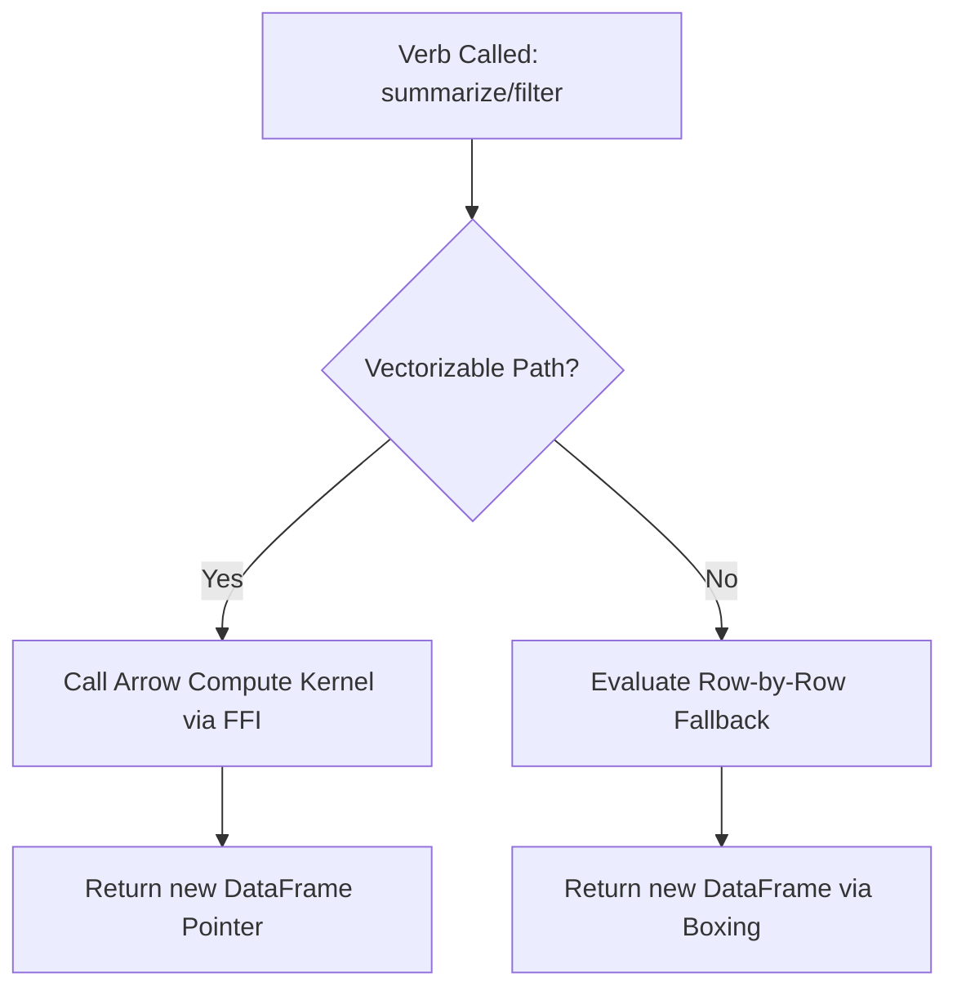

# Implementation Guide: Column-Vectorized Processing

This document outlines the architectural shift from row-wise, "boxed-value" evaluation to column-vectorized processing using Apache Arrow compute kernels. Implementing this guide will improve performance by 100x–1000x for large datasets.

## 1. The Bottleneck: Heap Boxing & Row Loops

The current slowness is caused by the "High-Level Value" abstraction (`Ast.value`).

### The Row-Wise Problem
When calculating `mean($fare_amount)` on 9.3 million rows:
1. **Extraction**: T extracts 9.3 million floats from Arrow's contiguous memory.
2. **Boxing**: For each float, T allocates a `VFloat` object on the OCaml heap.
3. **Iteration**: An OCaml loop iterates through these 9.3 million objects, unboxing them to sum them up.

**Result**: You spend 99% of your time allocating memory and GC-ing objects rather than doing math.

### The Vectorized Solution
Maintain data in native memory (Apache Arrow) and call **Compute Kernels** (C++/SIMD) that operate directly on the memory buffers without ever creating OCaml `Ast.value` objects for individual rows.

---

## 2. Architectural Pattern: The "Fast Path"

Every "verb" (mutate, summarize, filter) should follow this pattern:



### 1. Detection
In `src/packages/colcraft/summarize.ml` (and others), we must detect if the expression is a simple aggregation:
- **Vectorizable**: `mean($col)`, `sum($col)`, `count()`.
- **Not Vectorizable**: `my_custom_func($col)`, or complex nested OCaml logic.

### 2. Execution
If the expression is `mean($fare_amount)`, instead of calling the standard `mean` function, call `Arrow_compute.mean_column`.

---

## 3. Implementing a Vectorized Aggregate

### Phase A: The C Stub (`src/ffi/arrow_stubs.c`)
Add a new binding to the Arrow C GLib API. For example, for a new aggregate like `median`:

```c
CAMLprim value caml_arrow_compute_median_column(value v_table_ptr, value v_col_name) {
  CAMLparam2(v_table_ptr, v_col_name);
  GArrowTable *table = (GArrowTable *)Nativeint_val(v_table_ptr);
  const char *col_name = String_val(v_col_name);

  // 1. Find the column
  GArrowChunkedArray *col = garrow_table_get_column_data(table, index);
  
  // 2. Call Arrow Compute function (simplified)
  GArrowScalar *result = garrow_compute_median(col, NULL, &error);
  
  // 3. Convert Scalar to OCaml float
  double val = garrow_double_scalar_get_value(GARROW_DOUBLE_SCALAR(result));
  
  CAMLreturn(caml_copy_double(val));
}
```

### Phase B: The OCaml Bridge (`src/arrow/arrow_compute.ml`)
Expose the capability:

```ocaml
let mean_column (t : Arrow_table.t) (col_name : string) : float option =
  match t.native_handle with
  | Some handle -> 
      Arrow_ffi.arrow_compute_mean_column handle.ptr col_name
  | None -> 
      (* O(n) fallback loop *)
```

### Phase C: Hooking into Verbs (`src/packages/colcraft/summarize.ml`)
Update `detect_simple_agg` to identify the kernels:

```ocaml
let detect_vectorizable_agg = function
  | Ast.Call(Var "mean", [Ast.DotAccess(Var "row", col)]) -> Some ("mean", col)
  | Ast.Call(Var "sum", [Ast.DotAccess(Var "row", col)])  -> Some ("sum", col)
  | _ -> None
```

In `summarize`, use `Arrow_compute.group_aggregate` whenever `detect_vectorizable_agg` returns `Some`.

---

## 4. Specific Verbs Optimization Guide

### Filter (`t_filter.ml`)
- **Current**: Creates an OCaml `bool array` by unboxing every row.
- **Goal**: Use `Arrow_compute.compare_column_scalar`.
- **Example**: `df |> filter($mpg > 20)` should translate to the Arrow `greater` kernel.

### Mutate (`mutate.ml`)
- **Current**: Evaluates expressions row-by-row.
- **Goal**: Use "Arithmetic Kernels".
- **Example**: `df |> mutate($total = $price * $qty)` should translate to `Arrow_compute.multiply_columns("price", "qty")`.

### Summarize (`summarize.ml`)
- **Current**: Split-Apply-Combine in OCaml.
- **Goal**: Use **Native Hash Grouping**.
- **Execution**: `Arrow_compute.group_by` already supports native grouping. Ensure `summarize` passes the aggregation request down to `Arrow_compute.group_aggregate`.

---

## 5. Summary of Priority Targets

1. **Aggregates**: `sum`, `mean`, `count`, `min`, `max`. (Highest impact on benchmarks).
2. **Comparisons**: `==`, `>`, `<`, `>=`, `<=`. (Critical for `filter`).
3. **Arithmetic**: `+`, `-`, `*`, `/`. (Critical for `mutate`).
4. **Group-By**: Fully native hash-table based aggregation.

By following this guide, engineers will ensure that the T language behaves like a modern data engine, keeping "data in the fast lane" (native memory) as long as possible.
