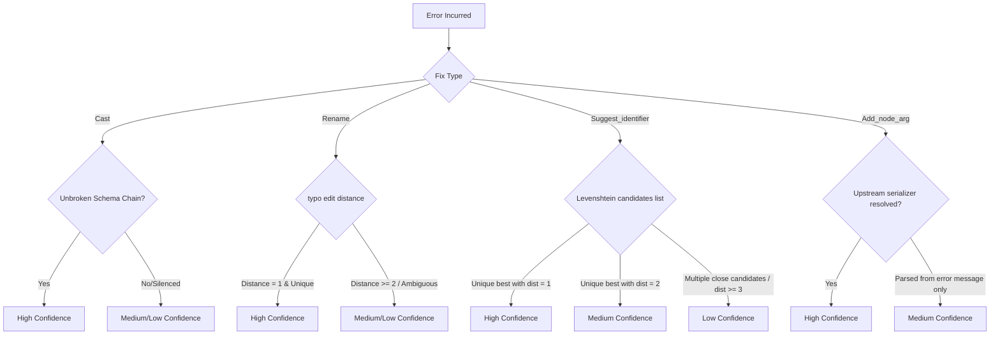

# Architectural Study: Calculated Suggested-Fix Confidence Levels

This document explores how to transition the `confidence` annotation on diagnostics from a static per-constructor label into a dynamic, context-aware signal computed at the point of inference.

---

## 1. Concrete Signals & Rules

For each suggested fix type, we compute confidence by analyzing the evidence backing the inference:



### `Cast` Fixes (Type Mismatches)
*   **Dynamic Rule:** If a type mismatch is detected on a schema derived from a fully typed, unbroken pipeline chain, confidence is **High**. If the schema chain passed through an unrecognized or custom function (which dropped schema propagation to `[]` downstream), the mismatch is likely a false positive or unreliable—confidence drops to **Medium** or the fix is suppressed.
*   **Implementation Signal:** Trace the schema chain's integrity (e.g. track a boolean flag `schema_is_complete` alongside the schema list through the DAG walk).

### `Rename_column` & `Suggest_identifier` Fixes (Typo/Spelling Suggestions)
To prevent two implementers from building inconsistent behavior, candidate uniqueness and thresholds are defined as follows:
*   **Candidate Search Range:** The search candidate list is retrieved via `levenshtein` distance comparison. A candidate `c` is valid if `levenshtein name c <= max(2, String.length name / 3)`.
*   **Defining Candidate Uniqueness:**
    *   **High Confidence:** Exactly one candidate is found within the search range with a distance of $1$, OR a best candidate has a distance of $1$ and the runner-up candidate has a distance difference of $\ge 2$ (e.g., best is distance 1, runner-up is distance 3 or more).
    *   **Medium Confidence:** The best candidate has a distance of $2$ and is unique, OR multiple candidates exist but the gap between the best and runner-up candidate is at least $1$ (e.g., best distance 1, runner-up distance 2).
    *   **Low Confidence:** Multiple candidates have the same edit distance (a tie), OR the best candidate distance is $\ge 3$.
*   **Implementation Signal:** The candidate picker returns the sorted list of candidates with their scores: `(string * int) list`.

### `Add_node_arg` Fixes (Missing Deserializers)
*   **Spike/Caveat:** The upstream node's serialization targets may not always be clean or exposed as a simple boolean flag to `t_check`. 
*   **Dynamic Rule:** If the upstream serializer is explicitly resolved by inspecting the pipeline DAG, confidence is **High**. If the compiler is parsing the error message text and guessing the default runtime serializer (e.g., default `^csv` for R/Python, `^arrow` for Julia), the signal is weaker—confidence remains **Medium**. If no runtime can be parsed, the fix remains **NoFix**.

---

## 2. Implementation Paths

To represent this in the compiler, we evaluate three available architectural paths:

### Path A: Typed AST Representation
Add `confidence` directly to the variant payload fields in `diagnostics.ml`.
*   **Pros:** Strongly typed, compiles-time verified.
*   **Cons:** Higher code churn across `fix.ml`, `t_fix.ml`, and tests.

### Path B: Contextual Serialization Helper
Keep the OCaml type constructors unchanged, but store the underlying signals (e.g., `distance`, `candidate_count`, `chain_broken`) inside the variant payloads, then resolve confidence inside `suggested_fix_to_yojson`.
*   **Pros:** Separates semantic compiler structures from client-facing diagnostic metrics; allows changing the mapping thresholds without changing all constructor sites.
*   **Cons:** Splits the confidence logic across two layers.

### Path C: Hybrid Approach (Recommended)
Store the raw signals (`distance`, `candidate_count`, `chain_broken`) directly in the variant constructor payloads, *and* include a required `confidence` field on the variant, computed once via a centralized pure function (`confidence_of_signals`) called at constructor instantiation time.

```ocaml
type confidence = High | Medium | Low

type suggested_fix =
  | Cast of {
      column: string;
      cast_to: string;
      target_node: string option;
      file: string option;
      line: int option;
      chain_broken: bool;
      confidence: confidence; (* Computed at instantiation *)
    }
  | Rename_column of {
      old_name: string;
      new_name: string;
      target_node: string option;
      file: string option;
      line: int option;
      edit_distance: int;
      is_unique: bool;
      confidence: confidence;
    }
```

*   **Why this is best:**
    *   **Testability:** The centralized `confidence_of_signals` function can be unit-tested independently against different edge cases (e.g., "does distance 2 and chain-broken output medium?").
    *   **Centralized Thresholding:** If we want to tune the thresholds (e.g., deciding distance-2 with a unique candidate deserves "high"), we only modify one place in the code, rather than auditing every construction site.
    *   **Compiler Enforcement:** Every constructor instantiation is still forced to compute and supply the confidence value, preventing silent omissions.

---

## 3. Recommended Next Steps

1.  **Refactor `Ast.suggest_name`** to return the sorted list of candidates with scores: 
    ```ocaml
    val suggest_name : string -> string list -> (string * int) list
    ```
2.  **Implement `confidence_of_signals`** in `diagnostics.ml` as a pure, centralized resolver.
3.  **Audit test assertions:** Update test suites (like `test_check.ml`) to use deliberate test fixtures (e.g., constructing a `Cast` fix with `chain_broken = true` to assert it degrades the serialized confidence correctly), rather than asserting static literals.
