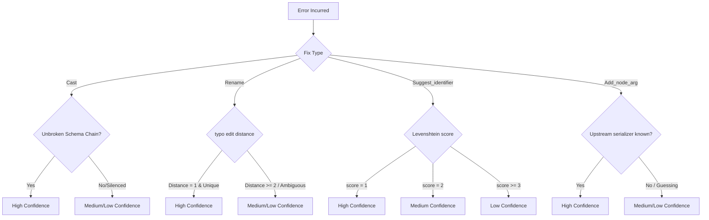

# Architectural Study: Calculated Suggested-Fix Confidence Levels

This document explores how to transition the `confidence` annotation on diagnostics from a static per-constructor label into a dynamic, context-aware signal computed at the point of inference.

---

## 1. Concrete Signals & Rules

For each suggested fix type, we can compute confidence by analyzing the evidence backing the inference:



### `Cast` Fixes (Type Mismatches)
*   **Dynamic Rule:** If a type mismatch is detected on a schema derived from a fully typed, unbroken pipeline chain, confidence is **High**. If the schema chain passed through an unrecognized or custom function (which dropped schema propagation to `[]` downstream), the mismatch is likely a false positive or unreliable—confidence drops to **Medium** or the fix is suppressed.
*   **Implementation Signal:** Trace the schema chain's integrity (e.g. track a boolean flag `schema_is_complete` alongside the schema list through the DAG walk).

### `Rename_column` Fixes (Missing Column References)
*   **Dynamic Rule:** If the renamer is matching a typo (e.g. suggesting `$mpg` for `$mpg2` or `$cyl` for `$cly`), confidence should reflect Levenshtein distance and candidate uniqueness:
    *   **High:** Distance = 1, and only one candidate exists in the schema within threshold.
    *   **Medium:** Distance = 2, or multiple similar candidates exist (e.g. schema has both `$cyl` and `$cycle` when matching `$cly`).
    *   **Low:** Distance $\ge$ 3, or high candidate ambiguity.
*   **Implementation Signal:** Leverage a revised `suggest_name` function that exposes edit distance and candidate-set cardinality.

### `Suggest_identifier` Fixes (Spelling Suggestions)
*   **Dynamic Rule:** Similar to renames, scale confidence directly with Levenshtein distance:
    *   **High:** Distance = 1 (e.g. `mutat` $\to$ `mutate`).
    *   **Medium:** Distance = 2 (e.g. `prnt` $\to$ `print`).
    *   **Low:** Distance $\ge$ 3.

### `Add_node_arg` Fixes (Missing Deserializers)
*   **Dynamic Rule:** If the compiler has access to the upstream dependency node's serialization target, it can resolve the missing deserializer with **High** confidence. If the compiler is guessing solely based on the dependency's runtime parsed from the error message (as it currently does), it is a heuristic—confidence is **Medium**.

---

## 2. Implementation Paths

To represent this in the compiler, we have two available architectural paths:

### Path A: Typed AST Representation (Recommended)
Add `confidence` directly to the variant payload fields in `diagnostics.ml`.

```ocaml
type confidence = High | Medium | Low

type suggested_fix =
  | Cast of {
      column: string;
      cast_to: string;
      target_node: string option;
      file: string option;
      line: int option;
      confidence: confidence; (* Added *)
    }
  | Rename_column of { ...; confidence: confidence }
  (* ... *)
```

*   **Pros:**
    *   Type safety: The compiler enforces that every piece of code generating a fix must explicitly calculate and supply a confidence score.
    *   Easily auditable: All inference sites are forced to declare their logic.
*   **Cons:**
    *   Requires updating all pattern matches (`fix.ml`, `t_fix.ml`, tests) to handle the new record field.

### Path B: Contextual Serialization Helper
Keep the OCaml type constructors unchanged, but store the underlying signals (e.g. `distance: int option`, `chain_broken: bool option`) inside the variant payloads, then resolve confidence inside `suggested_fix_to_yojson`.

*   **Pros:**
    *   Separates semantic compiler structures from client-facing diagnostic metrics.
    *   Slightly less pattern-matching code churn.
*   **Cons:**
    *   Splits the confidence logic across two layers (computational signals stored in AST, resolved to label at serialization).

---

## 3. Recommended Next Steps

If we proceed with Path A, the immediate tasks are:
1.  Refactor `Ast.suggest_name` to return the score: `val suggest_name : string -> string list -> (string * int) option`.
2.  Extend `Diagnostics.suggested_fix` variants with `confidence: confidence`.
3.  Thread the Levenshtein score from name suggestions and the schema-integrity flag from `schema_check.ml` into the construction sites.
