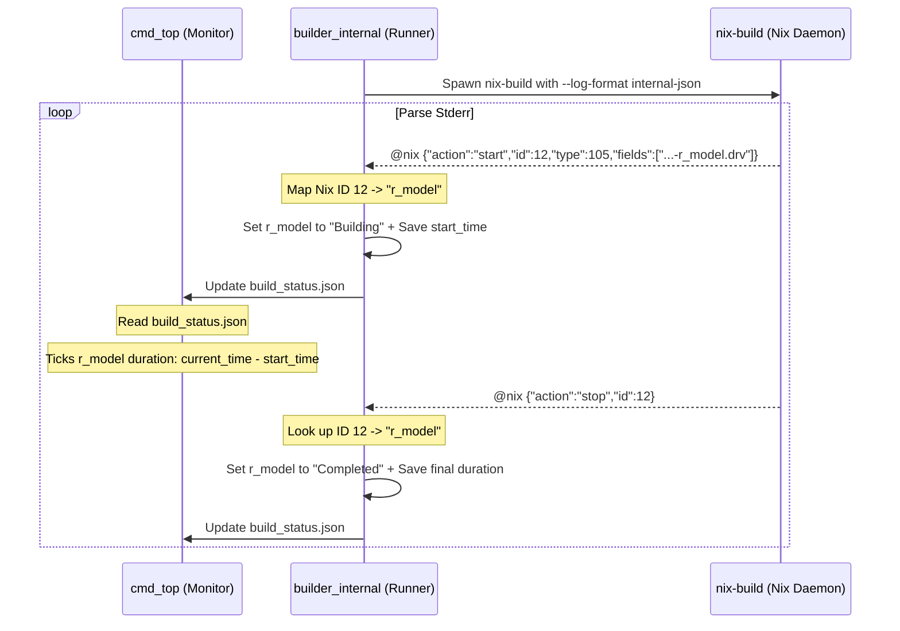

# Specification: Nix Internal JSON Log Parser for T-Lang Pipeline Monitor

Status: Draft
Author: Antigravity (AI Pair Programmer)
Date: 2026-06-16

## 1. Architecture Goal

The current `t top` execution relies on a regex-based parser that scans the unstructured stdout/stderr of `nix-build`. While this approach successfully identifies when builds start and finish, it has two major limitations:
1. **Coarse-grained updates**: Nix buffers its stdout/stderr and only prints final output store paths (e.g. `/nix/store/...`) at the very end of the build. As a result, all nodes remain in the `Building` state throughout the entire run, transitioning to `Completed` simultaneously when the command exits.
2. **Static duration display**: During the build phase, durations show as `—` because the runner has no way of updating the active elapsed time in the status JSON file without heavy disk I/O.

To address these limitations, we propose switching the runner's nix build invocation to use the `--log-format internal-json` flag. This flag enables Nix to stream structured, real-time lifecycle events. By parsing these events:
- The runner can map individual Nix activities to specific pipeline nodes.
- The monitor can transitions nodes to `Building` and `Completed` in real-time as Nix actually schedules and finishes them.
- The TUI can calculate and display ticking, real-time duration counters for actively building nodes.

---

## 2. Nix Structured Log Stream Schema

When running a Nix command with `--log-format internal-json`, Nix outputs JSON lines prefixed with `@nix ` to standard error.

### General Event Format
```json
@nix {"action":"<action>","id":<id>,"type":<type>,"fields":[...],"text":"..."}
```
- **`@nix ` Prefix**: Every structured log line begins with the literal string `@nix ` (5 characters). Any line not beginning with this prefix is treated as raw build log/informational text.
- **`action`**: The lifecycle event action (e.g., `"start"`, `"stop"`, `"result"`, `"msg"`).
- **`id`**: A unique integer identifying the Nix build activity or session.
- **`type`**: An integer mapping to Nix's internal `ActivityType` (e.g. `105` for a derivation build).
- **`fields`**: An array of arguments providing activity-specific metadata.

### Relevant Events

#### 1. Activity Started (`action = "start"`)
Emitted when a new Nix task (such as building a derivation or downloading a binary path) starts.
```json
@nix {"action":"start","id":12,"type":105,"fields":["/nix/store/h1a...-r_model.drv","x86_64-linux",...]}
```
For our parser, we specifically monitor activity type `105` (representing `actBuild`). The first element of the `fields` array contains the path to the derivation (`.drv`) being built.

#### 2. Activity Stopped (`action = "stop"`)
Emitted when an activity completes or terminates.
```json
@nix {"action":"stop","id":12}
```
The activity is identified solely by the `"id"` field. The parser uses this to lookup the mapped node name and mark it as completed or stopped.

#### 3. Log Messages (`action = "msg"`)
Emitted for build stdout/stderr lines or error messages.
```json
@nix {"action":"msg","id":12,"level":0,"msg":"error: compilation failed in r_model..."}
```
If the level indicates an error or the message contains error flags, the parser uses it to transition the corresponding node to `Errored`.

---

## 3. Proposed Changes



### Component A: Build Runner (`src/pipeline/builder_internal.ml`)

The build runner is responsible for spawning `nix-build` and parsing the stdout/stderr stream.

1. **Nix Command Invocation**:
   Add `--log-format` and `internal-json` to the arguments passed to `nix-build`.
   ```diff
   - ["nix-build"; "--impure"; pipeline_nix_path] @ target_args @ ["--no-out-link"] @ all_args
   + ["nix-build"; "--impure"; pipeline_nix_path] @ target_args @ ["--no-out-link"; "--log-format"; "internal-json"] @ all_args
   ```

2. **Parser State Management**:
   We will introduce a mapping table to associate Nix activity IDs with node names.
   ```ocaml
   (* Map Nix activity ID (int) to node name (string) *)
   let nix_id_to_node = Hashtbl.create 16
   ```

3. **Stream Parsing Callback**:
   Modify the stderr/stdout parsing callback to check for the `@nix ` prefix:
   - **JSON Line**:
     - Strip the `@nix ` prefix and parse using `Yojson.Safe.from_string`.
     - On `"action": "start"` with `"type": 105`:
       - Match the `.drv` path in `fields` to a node name.
       - Store `id -> node_name` in `nix_id_to_node`.
       - Transition status to `"Building"`.
       - Record `node_start_times` using `Unix.gettimeofday ()`.
       - Write to `build_status.json`.
     - On `"action": "stop"`:
       - Retrieve the node name using the activity `id` from `nix_id_to_node`.
       - Transition status to `"Completed"` (or `"Errored"` if a failure was logged).
       - Compute duration using `Unix.gettimeofday () -. start_time`.
       - Write to `build_status.json`.
   - **Fallback Raw Line**:
     - Standard stderr text (such as custom warnings or sandbox messages) may be printed. We parse these as text to ensure backward compatibility and scan for keywords like `error:` or `failed`.

4. **JSON Serialization Update**:
   Update `write_build_status_file` to write the node's `start_time` (as a Unix timestamp float) to the status JSON when it is in the `"Building"` state.
   ```json
   "r_model": {
     "status": "Building",
     "duration": 0.0,
     "start_time": 1729019230.123,
     "runtime": "R",
     "dependencies": ["mtcars"]
   }
   ```

### Component B: TUI / Monitor (`src/cmd_top.ml`)

The TUI reads `build_status.json` and renders it on screen.

1. **Parse Start Time**:
   Update `read_status_file` to parse `start_time` (if present) for each node.
   ```ocaml
   let start_time = match node_json |> member "start_time" with `Float f -> Some f | _ -> None in
   ```

2. **Real-Time Duration Ticking**:
   When rendering the table row for a node:
   - If the status is `"Building"` (or `"Fetching"`) and `start_time` is available:
     - Compute the current elapsed duration dynamically:
       ```ocaml
       let current_duration = Unix.gettimeofday () -. start_time in
       ```
     - Display this value formatted as `%.1fs` (e.g. `12.3s`) with the cyan color.
   - If the status is `"Completed"`, `"Errored"`, or `"SoftFailed"`, display the recorded static `duration` value.
   - For `"Pending"` or `"Cached"`, display `—`.

---

## 4. Verification Plan

### Automated Tests
- Test cases parsing simulated JSON lines to verify start/stop event mapping and edge-case log lines.
- Mocking `nix-build --log-format internal-json` output streams to verify the callback correctly populates `nix_id_to_node` and transitions statuses.

### Manual Verification
1. Run `dune build` to compile the changes.
2. Execute a pipeline with long-running steps (e.g. R `Sys.sleep(15)`) under `t top run`.
3. Verify that:
   - The TUI appears immediately with the loading indicator.
   - Each node transitions from `Pending` -> `Building` -> `Completed` dynamically as Nix schedules them.
   - Building nodes display a ticking, live-updated timer (e.g. incrementing `1.0s` -> `2.0s` -> `3.0s` every second).
   - Columns remain perfectly aligned.
