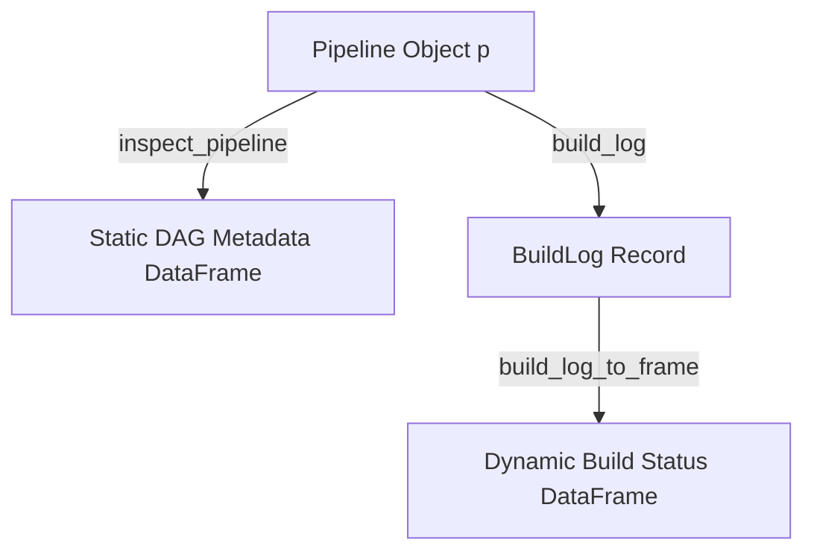

# Brainstorming: Clarifying the Roles of `inspect_pipeline` and `build_log`

This document proposes a design and refactoring plan to clarify the roles of `inspect_pipeline` and `build_log`. Currently, both functions overlap in accessing build logs on the filesystem, but they return different data structures under names that can be confusing to users.

---

## 1. The Current State & Semantic Overlaps

Currently, T provides two main built-ins to query pipeline execution and structure:

| Function | Primary Parameter | Return Type | Source under the hood | Purpose |
| :--- | :--- | :--- | :--- | :--- |
| **`build_log(p)`** | `p` (`VPipeline`) | `VBuildLog` record | `_pipeline/` build logs | Returns run statistics (duration, failed nodes list) |
| **`inspect_pipeline(p)`** | `p` (`VPipeline`, optional) | `VDataFrame` | `_pipeline/` build logs | Returns a DataFrame of derivation names, success status, and store paths |

### Key Issues:

1. **Naming Inconsistency (Static vs. Dynamic)**
   - `inspect_node(node)` inspects the **in-memory definition** of a single node (unbuilt or built, returning name, dependencies, serializer, class, etc.).
   - `inspect_pipeline(p)` does **not** inspect the in-memory definition/definition schema of `p`. Instead, it reads **dynamic build logs** from a past Nix run on the filesystem.
   - This creates a cognitive gap: a user expects `inspect_pipeline(p)` to show the DAG schema, runtimes, and dependencies defined inside `p`, not to read `.json` files in `_pipeline/`.

2. **Functional Redundancy**
   - Both functions read from the latest log in the `_pipeline/` directory. 
   - Having two independent top-level builtins doing filesystem IO to parse the same logs is redundant and harder to maintain.

3. **Log-Centric vs. Pipeline-Centric APIs**
   - `build_log(p)` is currently tied to a pipeline object `p` but actually reads a global latest log file in `_pipeline/`. 
   - If a pipeline has never been built, both `build_log(p)` and `inspect_pipeline(p)` raise a `FileError` rather than inspecting the structure of `p`.

---

## 2. Proposed Refactoring: Clear Separation of Concerns

We propose a clean division:
* **Static Inspection (`inspect_pipeline`)**: Query the in-memory schema, dependencies, and definitions of a pipeline.
* **Execution Logs (`build_log` & `inspect_log`)**: Query historical or run-time statistics from filesystem logs.



### Proposal A: Static Pipeline Inspection (`inspect_pipeline`)
`inspect_pipeline(p)` is redefined to perform **static schema inspection** of the pipeline's structure without requiring a build log or filesystem access.

#### Expected Return:
A `DataFrame` containing columns outlining the compile-time configuration of the pipeline:

| Column | Type | Description |
| :--- | :--- | :--- |
| `node` | `String` | The defined name of the node (e.g., `clean_data`) |
| `runtime` | `String` | The designated runtime (e.g., `python`, `r`, `julia`) |
| `serializer` | `String` | The designated serializer format (e.g., `arrow`, `csv`) |
| `dependencies` | `List[String]`| List of direct upstream dependency nodes |
| `has_script` | `Bool` | Whether it relies on an external script file |

#### Example Usage:
```t
p = pipeline {
  raw = rn("raw.csv"),
  clean = pyn(raw, script = "clean.py"),
  model = jln(clean, script = "model.jl")
}

# This works instantly, even BEFORE running build_pipeline(p)!
inspect_pipeline(p)
# Returns:
# DataFrame with columns: node, runtime, serializer, dependencies, has_script
```

---

### Proposal B: Dynamic Run Logs (`build_log` / `inspect_log`)
We consolidate all dynamic filesystem log operations into the `build_log` ecosystem.

1. **`build_log(p)` / `build_log(which_log = "pattern")`**
   - Returns a structured `VBuildLog` record carrying:
     - `.duration` (Float)
     - `.failed_nodes` (List of Strings)
     - `.nodes` (List of computed node records)
     - `.out_path` (Optional Nix output path)

2. **Interactive Log Inspection (`inspect_log`)**
   - To replace the old role of `inspect_pipeline`, we introduce a dedicated `inspect_log` or `build_log_to_frame` function:
   ```t
   # Option 1: Directly inspect the latest logs as a DataFrame
   inspect_log() 
   inspect_log(which_log = "2026-05-22")
   
   # Option 2: Pipe a build_log directly into a frame converter
   build_log(p) |> build_log_to_frame()
   ```

---

## 3. Detailed API Specification

### 1. `inspect_pipeline` (Static)
* **Signature**: `inspect_pipeline(p: Pipeline)`
* **Behavior**:
  - Traverses `p.p_nodes`, `p.p_deps`, `p.p_serializers`, `p.p_runtimes`, and `p.p_scripts`.
  - Constructs and returns an Arrow-backed `DataFrame` representing the static definition.
  - Never hits the filesystem or `_pipeline/` directory.

### 2. `build_log` (Dynamic)
* **Signature**: `build_log(p: Pipeline, which_log: String | NA = NA)`
* **Behavior**:
  - Reads `_pipeline/` to fetch Nix build run histories.
  - Returns a high-level record allowing dot-access fields: `log.duration`, `log.failed_nodes`.

### 3. `inspect_log` / `build_log_to_frame` (Dynamic)
* **Signature**: `inspect_log(which_log: String | NA = NA)` or `build_log_to_frame(log: BuildLog)`
* **Behavior**:
  - Converts a run log's entries (derivation paths, success statuses, output folders) into an interactive `DataFrame` for REPL filtering and analytics.

---

## 4. Transition & Backward Compatibility Plan

No backwards compatibility required. Just change the implementation and adapt the tests.
